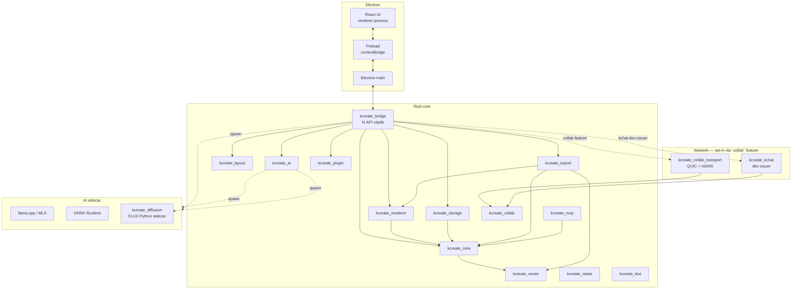

# KCreate — Technical Architecture

This document describes how KCreate is built. It is the technical
counterpart to `PROPOSAL.md` (product spec) and `PROGRESS.md` (shipping
status). When the architecture changes, this file is updated in the
same PR.

---

## 7. High-level architecture



## 8. Process model

KCreate runs in up to five distinct processes:

1. **Electron main** — owns the `BrowserWindow`, lifecycle, file dialogs,
   IPC handlers. Loads the Rust bridge via `process.dlopen`.
2. **Electron renderer** — React UI. No native code. Talks to the bridge
   exclusively through the preload-exposed `window.kcreate.*` API.
3. **Electron preload** — runs in a privileged Node context, uses
   `contextBridge.exposeInMainWorld` to expose a small typed surface.
4. **AI sidecar** — long-lived `llama.cpp` / MLX / ONNX process spawned
   on demand. Communicates over loopback HTTP (`127.0.0.1:<port>`,
   OpenAI-compatible `/v1/chat/completions` against `llama-server`).
   Lifecycle managed by `kcreate_ai::llm_sidecar::LlmSidecar`. Runs at
   a lower priority and is killable independently of the editor.
5. **MCP server** — local-loopback server (built, `kcreate_mcp`).
   Exposes `list_artboards`, `create_node`, `export_artboard` via
   JSON-RPC on `127.0.0.1:<port>`. Gated by an `McpPermissionStore`
   (`kcreate_mcp::permissions`) which persists per-client / per-tool
   grants (`Once` / `Always` / `Denied`) to JSON on disk.
6. **LAN collaboration transport** — tokio-based QUIC endpoint +
   mDNS responder, spawned inside `kcreate_bridge::collab` when the
   `collab` feature is enabled. Runs in a dedicated tokio
   multi-thread runtime so the editing path stays sync. Each peer
   advertises an ephemeral self-signed TLS certificate over mDNS-SD;
   peer trust is anchored to the Ed25519 identity exposed by
   `kcreate_collab::peer::PeerId` and pinned via SHA-256 fingerprint.
   Communication with the editing path uses broadcast / mpsc
   channels owned by `SessionState`; the editing path never sees a
   socket directly. The diffusion sidecar process listed under (4)
   is `tools/kcreate_diffusion/server.py` — a loopback FLUX
   inference daemon spawned by `kcreate_ai::image_gen`.

The renderer process never imports native code. The bridge cdylib lives
in the Electron main process only.

## 9. Electron ↔ Rust communication

Two channels, each tuned for its workload:

- **N-API (low-latency, blocking).** Renderer frames, scene updates,
  pointer events, and document CRUD. This path's round-trip is the
  pixel-readback + IPC pipeline — every microsecond matters.
- **Sidecar IPC (asynchronous).** AI model loads, inference, MCP tool
  calls. Long-running, cancellable, may stream tokens.

The N-API surface is strictly thin. All business logic lives in
`kcreate_bridge::state` and friends; `lib.rs` is a marshalling layer.

## 10. Canvas rendering

### Phase 0 — offscreen wgpu + readback

```
Scene (JSON) ──► kcreate_bridge::wire::parse_scene
                  │
                  ▼
            DisplayList build
                  │
                  ▼
        wgpu offscreen render
                  │
                  ▼
        GPU → CPU readback (triple-buffered)
                  │
                  ▼
        N-API Buffer → preload → ImageData → <canvas>
```

The Rust side owns the entire pipeline. The Electron renderer only
calls `ctx.putImageData(...)`. This guarantees we can replace the
presentation path without rewriting the pipeline.

### Phase 1 — native CanvasHost

Phase 1 replaces only the presentation path: a native child view obtained
via `raw-window-handle` becomes the wgpu surface, eliminating the
readback + IPC + `putImageData` round trip. The display list, scene
graph, viewport, dirty regions, and presenter remain unchanged.

## 11. Platform GPU backends

| Platform        | Primary    | Fallback        | Software       |
| --------------- | ---------- | --------------- | -------------- |
| macOS Intel     | Metal      | —               | `tiny-skia`    |
| macOS Apple Si  | Metal      | —               | `tiny-skia`    |
| Windows x64     | D3D12      | Vulkan          | `tiny-skia`    |
| Linux x64       | Vulkan     | OpenGL ES       | `tiny-skia`    |
| Linux arm64     | Vulkan     | OpenGL ES       | `tiny-skia`    |

`tiny-skia` is a real, production-grade software rasterizer. It runs
the same display list as the GPU backend; switching is transparent.

## 12. Shared document model

Conceptually:

```
Project
├── Pages
│   └── Artboards
│       └── Layers (group / vector / raster / text / component / layout-frame)
└── Brand kits, design tokens, export presets, operation log
```

### Internal node structure

Implemented in `kcreate_core::node::Node`:

```rust
pub struct Node {
    pub id: Uuid,
    pub node_type: NodeType,
    pub parent_id: Option<Uuid>,
    pub children: Vec<Uuid>,
    pub bounds: Bounds,
    pub transform: Transform2D,
    pub opacity: f32,
    pub blend_mode: BlendMode,
    pub visible: bool,
    pub locked: bool,
    pub name: String,
    pub style: NodeStyle,
    pub effects: Vec<Effect>,
    pub constraints: Constraints,
    pub metadata: HashMap<String, serde_json::Value>,
    pub version: u64,
}
```

`NodeType`, `BlendMode`, `Effect`, `NodeStyle`, `Constraints`,
`Transform2D`, and `Bounds` are described in `kcreate_core::node`. All
types are `Serialize` + `Deserialize` and round-trip cleanly through
JSON for IPC and SQLite persistence.

### Document graph

The document is a flat `HashMap<Uuid, Node>` with tree structure stored
via each node's `parent_id` and `children`. We learned from
`ux-open-pencil` that O(1) lookups by id are critical when an artboard
holds thousands of nodes; tree walks are only needed for explicit
traversal, hit-testing, and rendering.

### Operation log

Implemented in `kcreate_core::operation::OperationLog`. Every mutation
appends an `Operation`:

```rust
pub struct Operation {
    pub id: Uuid,
    pub timestamp: DateTime<Utc>,
    pub actor: String,
    pub command: String,
    pub before_patch: serde_json::Value,
    pub after_patch: serde_json::Value,
    pub affected_nodes: Vec<Uuid>,
    pub ai_generated: bool,
}
```

`undo` and `redo` move a position cursor over the history; a new
`push` truncates any redo-stack tail. Max-depth trimming bounds the log
to a configurable size (`RuntimeConfig::max_undo_depth`).

## 13. Local file format — `.kstudio/`

Native projects are folders, not opaque archives:

```
my-project.kstudio/
├── manifest.json          // format version, project id, timestamps
├── document.sqlite        // node tree + operation log + assets table
├── blobs/                 // content-addressed binary blobs (BLAKE3)
│   ├── ab/abcd123…blob
│   └── …
├── thumbnails/            // page thumbnails (PNG)
├── exports/               // user-exported files
├── ai/                    // AI action log (mirrored from SQLite)
└── cache/                 // ephemeral derived caches; safe to delete
```

The folder is transparent: any file manager shows its contents. The
SQLite database is encrypted at rest (Phase 1+ with SQLCipher).
Content-addressed dedup lets re-imports of the same asset cost zero
disk.

`manifest.json` format:

```json
{
  "version": "0.1.0",
  "name": "My Project",
  "id": "550e8400-e29b-41d4-a716-446655440000",
  "created_at": "2026-05-21T08:00:00Z",
  "modified_at": "2026-05-21T08:00:00Z",
  "format": "kstudio-v1"
}
```

## 14. Engine design

### Rendering pipeline

`kcreate_renderer::Pipeline`:

```
Scene ──► invalidate ──► dirty region tracker
       │                       │
       ├──► display list (with cache) ──► backend (GPU | CPU)
       │                                       │
       └── viewport (pan, zoom) ───────────────┘
                                               │
                                               ▼
                                         Presenter (triple-buffered)
```

### Raster tile engine

Implemented in `kcreate_raster::tile::TileGrid`. Tiles of 256×256
(configurable). Memory budget driven by
`RuntimeConfig::max_raster_cache_mb`. Tiles are produced lazily and
cached LRU; pan only invalidates uncovered regions. Dirty-tile
tracking for incremental updates.

### Vector engine

- **Path representation:** compact `Vec<PathSegment>` arrays in
  `kcreate_vector::path::VectorPath`. Closed paths are first-class
  (`closed: bool`); fill rule is explicit.
- **Spatial index:** R-tree from `rstar` in
  `kcreate_vector::spatial_index::VectorSpatialIndex`.
- **Boolean ops:** delegated to `i_overlay` for production-grade
  Greiner-Hormann polygon clipping in
  `kcreate_vector::boolean::boolean_operation`.
- **SVG import:** `usvg` parses the source; we walk the tree and emit
  `VectorPath`s with fills lifted into metadata.
- **SVG export:** `kcreate_vector::svg_export` produces clean,
  developer-friendly SVG with explicit `viewBox`, no superfluous
  groups, and compact path data.

### Text engine

Implemented in `kcreate_text`. Font discovery via `fontdb`
(bitmap-only fonts skipped). Shaping with `rustybuzz`. Outline
walking via `ttf-parser` produces `VectorPath` data fed directly into
the renderer (`ObjectKind::Text`). Glyph atlas built lazily,
GPU-uploaded once.

### Layout engine

Implemented in `kcreate_layout`. Pure-Rust flex + grid solvers. No
DOM, no side effects — the solver consumes a `LayoutNode` tree and
returns computed boxes. Reuses the renderer's dirty-region tracker
so a single token change repaints only the affected layers.

### CPU / GPU support by platform

| Platform        | wgpu  | tiny-skia | ONNX  | llama.cpp |
| --------------- | :---: | :-------: | :---: | :-------: |
| macOS Intel     |   ✅  |    ✅     |   ✅  |    ✅     |
| macOS Apple Si  |   ✅  |    ✅     |   ✅  |    ✅ (MLX)|
| Windows x64     |   ✅  |    ✅     |   ✅  |    ✅     |
| Linux x64       |   ✅  |    ✅     |   ✅  |    ✅     |
| Linux arm64     |   ✅  |    ✅     |   ✅  |    ✅     |

### Device performance tiers

Defined in `kcreate_core::config::DeviceTier` (selected by
`DeviceTier::from_system_info` — a pure function over
`SystemInfo { total_ram_mb, gpu_available, … }`):

| Tier   | RAM bound     | GPU required? | Behavior                                                      |
| ------ | ------------- | ------------- | ------------------------------------------------------------- |
| Tier 0 | `< 8 GB`      | No            | Low-resource mode forced. Undo depth 32. CPU rasterizer only. |
| Tier 1 | `≥ 8 GB`      | No            | Undo depth 128. GPU backend used if probed available, CPU fallback otherwise. AI models limited to ≤ 2 GB. |
| Tier 2 | `≥ 16 GB`     | **Yes**       | Undo depth 256. Full GPU pipeline. AI models up to 7 GB.       |
| Tier 3 | `≥ 32 GB`     | **Yes**       | Undo depth 1024. All features; larger model packs; multi-document. |

Selection rules, encoded directly in
[`DeviceTier::from_system_info`](../crates/kcreate_core/src/config.rs):

1. **RAM is the floor; GPU upgrades the ceiling.** RAM-only thresholds
   are evaluated top-down. A box with ≥ 16 GB but no usable GPU is
   classified Tier 1 (not Tier 2), because the GPU-dependent budgets
   for Tier 2+ assume a working GPU pipeline. The same machine with
   a discrete GPU is Tier 2.
2. **No minimum on Tier 0.** Anything that doesn't meet Tier 1's 8 GB
   threshold — including a host where the RAM probe failed and
   `total_ram_mb` is `0` — falls to Tier 0. Tier 0 stays usable on
   minimal hardware (the CPU rasterizer is in-tree and forbids
   `unsafe`), but defaults to low-resource mode.
3. **Apple Silicon counts as a "GPU".** `gpu_available` is set true
   on Apple Silicon by the host probe even for unified-memory
   systems, so an M-series Mac with ≥ 32 GB lands in Tier 3.

The decision is intentionally pure and unit-testable: the platform
probe lives in [`RuntimeConfig::detect`](../crates/kcreate_core/src/config.rs)
and produces `SystemInfo`; tier selection consumes it without
touching the OS. Tests construct `SystemInfo` directly to verify
the boundary cases (no-GPU/16 GB, GPU/8 GB, etc.).

### Low-resource mode

When detected (or explicitly enabled in `RuntimeConfig`):

- Disable hover previews and live filters.
- Reduce raster cache budget.
- Cap undo depth to 32 operations.
- Disable speculative thumbnails.
- Suspend background indexing.

## 16. Local AI architecture

```
┌───────────────────────────────────────────────────────────┐
│  Editor (Electron renderer)                               │
└──────────────────────────┬────────────────────────────────┘
                           │ AI Action request
                           ▼
                ┌────────────────────┐
                │  AI Task Router    │  (in kcreate_ai)
                └─────┬──────────────┘
                      │ chooses model pack
        ┌─────────────┼──────────────────┐
        ▼             ▼                  ▼
┌──────────────┐ ┌──────────────┐ ┌──────────────┐
│ Model Mgr    │ │  Tool Exec   │ │ Safety Layer │
│ (load/unload)│ │ (sandboxed)  │ │ (logging,    │
│              │ │              │ │  permissions)│
└──────┬───────┘ └──────┬───────┘ └──────┬───────┘
       │                │                │
       ▼                ▼                ▼
┌─────────────────────────────────────────────┐
│      AI Action Log (operation_log + ai/)     │
└─────────────────────────────────────────────┘
```

### Model packs (Phase 1+)

- **Core Pack** — small LLM, background removal (e.g. `u2net`), upscale.
- **Image Pro** — segmentation, inpainting, denoise.
- **Design Pro** — palette extraction, layout suggestions.
- **Generation** — diffusion model packs (opt-in due to size).

### MCP server

`kcreate_mcp` exposes a permissioned local-loopback MCP server
(loopback-only HTTP JSON-RPC via `tiny_http`, disabled by default).
Initial tools:

1. `list_artboards` — return artboard names + ids.
2. `create_node(parent_id, node_type, props)` — create a layer.
3. `export_artboard(id, format, path)` — export to file (SVG today).

Permission model: every tool call surfaces a dialog the first time it
is invoked from a new client; the user can grant once / always / deny.
Granted permissions are scoped per project.

## 16a. Prototype / interaction model

Every node in `kcreate_core::node::Node` may carry zero or more
`Interaction`s, each of which is an `(InteractionTrigger,
InteractionAction)` pair:

- `InteractionTrigger::{Click, Hover, Drag, AfterDelay(ms)}`
- `InteractionAction::{NavigateToArtboard(uuid), OpenUrl(String),
  Close, Toggle(uuid)}`

The bridge exposes `interaction_add`, `interaction_remove`,
`interaction_list`, and a batched `interaction_list_batch` (so
`PrototypePlayer` can pre-warm every reachable artboard in one
round-trip). The renderer treats interactions as inert metadata —
only `PrototypePlayer.tsx` consumes them, overlaying the canvas in a
fullscreen modal during prototype mode.

## 16b. Layout Studio page model

`kcreate_core` ships a print-aware page document model:

- `PageLayout { size, orientation, margins, bleed_mm, master_id }`
- `PageSize::{A4, A3, A5, Letter, Legal, Tabloid, Custom { w, h }}`
- `PageOrientation::{Portrait, Landscape}`
- `Margins { top, right, bottom, left }`

Pages can reference a *master* page; the bridge functions
`master_create / master_list / master_apply / master_detach`
keep child pages aligned to the master's nodes until a child is
explicitly detached. Three built-in templates ship in
`kcreate_core::project::templates`: Pitch Deck, Proposal, Brochure.

## 16c. Native canvas lifecycle

The native canvas path lives in
`kcreate_bridge/src/native_canvas.rs` behind the `native_canvas`
feature flag. It is the only place in the tree where
`#![allow(unsafe_code)]` is permitted (workspace lint denies it
everywhere else). Window handles arrive as a typed
`PlatformHandle::{AppKitWindow, Win32Window, XlibWindow,
XcbWindow}`; Wayland is declined gracefully (no SHM-buffer path yet),
falling back to the offscreen presenter.

The Electron window's `close` event hooks into the bridge to switch
the renderer back to offscreen mode before the window is destroyed,
so the renderer never holds a dangling platform handle. Linux X11
and XCB are supported; Linux Wayland declines to native and stays
on the offscreen path.

## 16d. PDF preflight pipeline

`kcreate_export::preflight::run_preflight(document, pages, options)`
runs six independent checks over a slice of pages:

1. `BleedMargin` — content layers extending into the bleed zone
   without explicit bleed extension produce a warning.
2. `FontEmbed` — every `TextLayer` is resolved against the local
   `fontdb`; missing fonts produce an error.
3. `ImageResolution` — every `RasterLayer` is checked against
   `target_dpi`; under-resolution produces a warning, severe
   under-resolution an error.
4. `ColorSpace` — RGB fills against a CMYK target produce a warning
   (Phase 3 will add auto-conversion).
5. `Transparency` — opacity / blend mode != Normal under a
   non-transparency-aware target produces a warning.
6. `PageSize` — non-standard `Custom` page sizes produce an info.

Each check returns `PreflightIssue { check, severity, message,
affected_node_id }`. The UI surfaces issues grouped by severity in
`PreflightPanel`.

## 16e. AI model pack registry

`kcreate_ai::model_registry::list_model_packs()` returns a curated
list of `ModelPack { id, name, category, kind, capabilities,
size_bytes, file_path, installed }`. `category` is one of
`Core`, `ImagePro`, `DesignPro`, `Generation`. `kind` is `BuiltIn`
(zero-disk pure-Rust impl), `Onnx` (downloaded ONNX file), or
`Sidecar` (LLM via the long-running sidecar process). Built-in
packs (Lanczos upscale, k-means palette, threshold bg-removal, BFS
smart-select) are always installed; ONNX / sidecar packs compute
`installed` by probing the local `models_dir`. Phase 2 declares
neural alternatives (ESRGAN, u2net, SAM); the actual download flow
is deferred to Phase 3.

## 16f. MCP permission store

`kcreate_mcp::permissions::McpPermissionStore` keeps a
`HashMap<(ClientId, ToolName), McpPermission>`. Each
`McpPermission` carries one of
`PermissionGrant::{Once, Always, Denied}` and a `DateTime<Utc>`.
The server gates every tool call against the store; `Once` grants
are consumed via `consume_if_once` after a successful call so the
next request prompts again. The store persists to JSON on disk so
grants survive restarts. The UI is `McpSettingsPanel.tsx`.

## 16g. Screenshot-to-layout pipeline

`kcreate_ai::screenshot_to_layout::analyze_screenshot_for_layout`:

1. Convert RGBA8 → grayscale.
2. Apply a Sobel operator → magnitude per pixel.
3. Threshold edges.
4. BFS connected-component labelling extracts bounding boxes.
5. Classify each region by aspect-ratio + position heuristics
   (wide+top = Header, wide+bottom = Footer, small+centred = Button,
   …) into `ElementType::{Header, Navigation, Hero, TextBlock,
   Image, Button, Card, Footer, Sidebar, Form, List}`.

Output is `Vec<DetectedElement>`. The Phase 4 VLM pass lives in
the same module as `refine_with_vlm` (16i) and is wired through
the AIAssist panel; the Rust pipeline returns the heuristic result
unchanged when no VLM is available.

## 16h. Plugin crate architecture

`kcreate_plugin` ships three sibling modules:

- `manifest`: `PluginManifest { id, name, version, author,
  description, plugin_type, entry_point, permissions }`,
  `PluginType::{Wasm, JsPanel, Native}`,
  `PluginPermission::{ReadDocument, WriteDocument, ReadAssets,
  ExportFiles, NetworkAccess}` (network is denied by default).
- `registry`: `PluginRegistry::scan(plugin_dir)` walks
  `<plugin_dir>/*/manifest.json` and loads each manifest. Enable
  state persists to `<plugin_dir>/.enabled.json`.
- `wasm_runtime`: wraps a `wasmi::Engine`. Plugins compile to a
  `Module` and execute under a deny-by-default sandbox
  (`memory_limit_pages`, no FS, no network, no host imports beyond
  the three intrinsics below). Host ABI:
  * `kcreate_log(ptr, len)` — append to the plugin log buffer.
  * `kcreate_get_input_len() -> u32`, `kcreate_get_input(ptr, len)
    -> u32` — read the caller-supplied input JSON into plugin
    memory.
  * `kcreate_set_output(ptr, len)` — set the output JSON returned
    to the caller.

Bridge entry points: `plugin_list`, `plugin_enable`,
`plugin_disable`, `plugin_execute(id, function, input_json)`. The
Phase 2 wire format is intentionally JSON-only; a richer typed API
(read_document, transform_path, …) lands in Phase 3.

## 16i. Vision model integration (Phase 4)

The vision path reuses the existing loopback-HTTP sidecar pattern
(see `llm_sidecar.rs`) but extends it in three ways:

1. **mmproj loading.** `SidecarConfig.mmproj_path: Option<PathBuf>`
   is validated against the filesystem and appended as
   `--mmproj <path>` to the llama-server argv. The
   `vision_*_mmproj` registry entries hold the same SHA256 +
   download URL plumbing as the main weights so a model
   downloader can fetch both halves and the sidecar refuses to
   start if either file is missing.
2. **Multimodal chat shape.** `ChatMessage.content` is no longer
   `String`; it is a `ChatContent` enum with `Text(String)` and
   `Multimodal(Vec<ContentPart>)` variants. `ContentPart` carries
   either a `text` chunk or an `image_url` chunk that serialises
   into the OpenAI vision-API shape with a `data:` URI containing
   a base64-encoded PNG. Text-only messages keep their plain
   `"content": "string"` serialisation for backward compatibility
   — every existing chat caller (Phase 1 LLM, Phase 3 task router)
   continues to work unchanged.
3. **Bridge surface.** `crates/kcreate_bridge/src/phase4.rs`
   exposes `vision_start(pack_id)`, `vision_stop`,
   `vision_status`, `vision_describe_image`,
   `vision_generate_alt_text`, `vision_analyze_design` — plus the
   higher-level features built on top (`vision_refine_layout`,
   `vision_extract_brand`, `vision_suggest_crop`,
   `vision_suggest_design_tokens`, `vision_describe_style`,
   `vision_layer_name_for_node`). Each higher-level call uses
   GBNF (`*::GRAMMAR`) so the VLM's reply is constrained to the
   exact JSON shape Rust expects to parse.

Vision sidecars are *soft-gated*: every tier is allowed to start
one, but the Model Manager caps the per-tier installable model
size at `DeviceTier::vision_model_max_mb` (Tier 0: 500 MB; Tier
1: 2 GB; Tier 2: 5 GB; Tier 3: 8 GB). Tier 0 + 1 default to
SmolVLM2-256M; Tier 2 + 3 default to Qwen2.5-VL-4B.

## 16j. Image generation pipeline (Phase 4)

Image generation is a *hard-gated* feature: when
`RuntimeConfig::image_generation_allowed()` is false (Tier < 2,
or no GPU detected), the UI removes the panel entirely and the
bridge refuses to spawn the sidecar. The pipeline itself:

1. `ImageGenSidecar` (`crates/kcreate_ai/src/image_gen.rs`) spawns
   `python3 -m kcreate_diffusion.server --model <path>
   --port <port>` on a loopback port. The companion package lives
   in `tools/kcreate_diffusion/` and wraps `diffusers` so the bulk
   of the inference code is upstream.
2. `image_gen_generate(prompt, width, height, steps, seed)` posts
   to `/v1/images/generations`; the response is a base64-encoded
   PNG which the bridge decodes and forwards to the renderer.
3. The renderer applies the Ask → Preview → Apply loop: the
   preview is a floating overlay, and Apply imports the bytes
   via `document_import_image_bytes` (MIME-sniffed, blob-stored
   under the same content-addressed BLAKE3 path used by
   imported assets). No temp files are written.

Two registry entries ship in this phase:
`image_gen_flux_klein_4b` (GGUF, llama.cpp via the diffusion
sidecar) and `image_gen_flux_klein_mlx` (Apple Silicon).

## 16k. MLX sidecar (Apple Silicon)

`crates/kcreate_ai/src/mlx_sidecar.rs` is a structural mirror of
`LlmSidecar` that spawns `python3 -m mlx_lm.server` instead of
`llama-server`. It is only used on Apple Silicon, and only when
`probe_mlx_available()` (which caches a `python3 -c "import
mlx_lm"` probe) returns `true`. On every other platform — and on
Apple Silicon when MLX is not installed — `SidecarDispatcher`
transparently falls back to the GGUF/llama-server pack returned
by `model_registry::gguf_fallback_for_mlx_pack` so the user never
sees an MLX-only failure.

### CPU / GPU support by platform

| Platform           | Renderer (Phase 1)   | LLM (Phase 3)    | Vision (Phase 4)              | Image Gen (Phase 4)         |
| ------------------ | -------------------- | ---------------- | ----------------------------- | --------------------------- |
| macOS (Apple Si)   | wgpu / Metal         | llama-server     | llama-server **or** MLX `mlx_lm` | FLUX.2-Klein-4B GGUF or MLX |
| macOS (Intel)      | wgpu / Metal         | llama-server     | llama-server                  | Disabled (no GPU tier)      |
| Windows            | wgpu / DX12          | llama-server     | llama-server                  | FLUX.2-Klein-4B GGUF (Tier 2+) |
| Linux (NVIDIA)     | wgpu / Vulkan        | llama-server     | llama-server                  | FLUX.2-Klein-4B GGUF (Tier 2+) |
| Linux (other GPU)  | wgpu / Vulkan        | llama-server     | llama-server                  | Disabled (CPU diffusion ≠ usable) |
| CPU fallback       | tiny-skia            | llama-server CPU | SmolVLM2-256M (CPU)           | Disabled                    |

## 17. Plugin types and runtime (Phase 2+)

| Tier     | Runtime          | Capabilities                           | Trust                  |
| -------- | ---------------- | -------------------------------------- | ---------------------- |
| WASM     | wasmtime         | Pure functions, transforms             | Default; sandboxed.    |
| JS panel | Electron sandbox | Side panels, prompts, simple tools     | Signed; restricted IPC.|
| Native   | dynamic library  | Heavy lifting (image filters, codecs)  | Signed + user opt-in.  |

## 17a. PDF import pipeline

`kcreate_export::pdf_import` is the inbound counterpart to the
`printpdf`-based exporter. It is intentionally **structural** — it
does not run a content-stream interpreter — and maps the structured
parts of a PDF onto KCreate's node graph 1:1:

- **Page geometry.** Each PDF page becomes one `ImportedPdfPage`
  carrying width/height in PDF points. `read_media_box` walks the
  `/Parent` chain per PDF 1.7 §7.7.3.4 so inherited MediaBoxes
  resolve correctly (capped to 32 hops to defeat cyclic page
  trees). Falls back to US Letter with a `MissingMediaBox` warning
  only when no ancestor declares the box.
- **Embedded images.** Every `Image` XObject referenced by every
  page's `Resources` is decoded:
  - `DCTDecode` (JPEG) passes through verbatim as a JPEG blob.
  - `FlateDecode` over an uncompressed pixel buffer is decoded
    (DeviceRGB / DeviceGray / DeviceCMYK at 8 bpc) and re-encoded
    as PNG. Other bpcs and unknown color spaces are surfaced as
    `UnsupportedImageColorSpace`. Decompression failures are
    surfaced as `UnsupportedImageFilter` with the lopdf error
    embedded — never silently swallowed.
- **Title / Author** are read from the PDF `Info` dictionary.

Bridge: `import_pdf(path) -> ImportedProject`. The renderer uses
this from the EditorPage "Import PDF" action; the importer is
purely additive (creates a new project) and never mutates an
existing one.

## 17b. Collaboration protocol foundation (Phase 3, ships in PR #7)

`kcreate_collab` is the *protocol-only* foundation for multi-peer
editing. It is deliberately kept **outside the editing-path
dependency tree** so a future transport (QUIC + mDNS discovery,
WebRTC, etc.) can pull in network crates without contaminating the
local-first invariant enforced by
`crates/kcreate_tests/tests/local_first.rs`.

Modules:

- `peer` — `PeerId` (16-byte BLAKE3 short id, base64url
  encoded; deterministic per Ed25519 keypair), `PeerFingerprint`
  (8 × 4 uppercase hex groups, for the UI trust dialog),
  `PeerIdentity` (public identity broadcast on the wire), `PeerKey`
  (local-only signing-key handle, never serialised).
- `clock` — `LamportClock`: 64-bit monotonic counter. `tick()`
  increments before send; `observe(remote)` is `max(local, remote)
  + 1` on receive. Panics on overflow (≈ 584 years at 1 ns / event).
- `envelope` — `Envelope<T>` and `SignedPayload<T>`: Ed25519-signed
  wrappers carrying `protocol_version`, `from`, `clock`, `nonce`,
  `payload`, `signature`. PROTOCOL_VERSION = 1. Canonical signing
  via deterministic JSON; `seal()` / `open()` detect tampering,
  wrong keys, and version mismatch.
- `message` — `Message` enum: `Hello`, `Welcome` (accept/reject
  with reason), `OperationBroadcast` (real `kcreate_core::Operation`
  payload, **not** a stub), `Presence` (cursor + selection),
  `Heartbeat`, `Goodbye` (Normal / Kicked / Error).
- `conflict` — `ConflictResolver` trait + `LastWriterWinsResolver`:
  disjoint `affected_nodes()` sets → `KeepBoth`; otherwise compare
  Lamport clocks, then break ties by larger peer-id.
- `session` — `ProjectSession`: holds the local identity, project
  id, clock, trusted-peers map, and per-peer replay window
  (`recent_nonces: VecDeque`). Seals outgoing messages, ingests
  envelope JSON, rejects untrusted peers / wrong project /
  replayed nonces. `SessionConfig` caps the replay window (32 K
  default) and the trusted-peer count (256 default).

Tests: 42 unit tests across the six modules — peer-id determinism,
fingerprint formatting, Lamport ordering preservation,
seal/open round-trips, tampering detection, version mismatch,
LWW tiebreaks across disjoint and overlapping affected-node sets,
replay-window rejection, project-id scoping, peer cap.

## 17c. KChat backend integration (Phase 7, ships in PR #17)

`kcreate_kchat_client` is the **HTTPS REST client** that lets
KCreate source membership attestations from the shared KChat /
Mattermost backend that `uneycom/uney-chat-desktop` also signs
in to. The integration follows **Option C** of the Phase 7
pivot: KCreate stays a standalone process and talks to the
backend directly over HTTPS, while a thin `.kcz` companion
extension hosted inside KChat Desktop renders sidebar surfaces
(`apps/kchat-extension/`). There is no local socket / named-pipe
IPC between the two desktop apps — that approach (originally
sketched in PR #17 before the pivot) was abandoned because the
KChat Desktop Extension Platform is a JS-only sandbox that
consumes host procedures via `defineProcedure()`, not a
peer-to-peer Electron IPC bridge.

The crate is kept **out of the editing-path dependency tree** —
even though it links `reqwest` / `rustls` — so the local-first
sentinel (`crates/kcreate_tests/tests/local_first.rs`) stays
green. The only consumer is `kcreate_bridge` under the
`kchat-backend` feature flag.

### REST surface

The full route catalogue lives in
[`crates/kcreate_kchat_client/src/rest.rs`](./crates/kcreate_kchat_client/src/rest.rs)
and the typed DTOs are in `crates/kcreate_kchat_client/src/dto.rs`.
At a glance:

| Route                                                        | Method | Purpose                                              |
| ------------------------------------------------------------ | ------ | ---------------------------------------------------- |
| `/api/v1/auth/login`                                         | POST   | Exchange credentials for access + refresh tokens.    |
| `/api/v1/auth/refresh`                                       | POST   | Pre-emptive token rotation; also fires on `401`.     |
| `/api/v1/me`                                                 | GET    | Local user JID + Ed25519 public key + display name.  |
| `/api/v1/communities`                                        | GET    | All communities the user belongs to.                 |
| `/api/v1/communities/{id}/members`                           | GET    | Roster + role for one community.                     |
| `/api/v1/communities/{id}/attestation`                       | POST   | Signed `KChatMembership` (backend signs over a peer pubkey + community id). Endpoint lands in a separate backend PR; until then the `kchat-dev-issuer` flag covers the same shape for tests. |
| `/api/v1/communities/{id}/conversations`                     | GET    | Channels in a community.                             |
| `/api/v1/conversations/{id}/messages`                        | POST   | Post a rich card (e.g. document-share invite).       |

TLS is strict (`reqwest` over `rustls`); the client refuses
`http://` URLs outside the in-process `axum` fixture used by
`kcreate_tests`. `401` responses transparently refresh the
access token (and replay the request once); `429` responses
retry with capped exponential backoff. Per-request timeout
defaults to 10 s.

### Community → collaboration gate mapping

`KChatBackendAuthority` (in
`crates/kcreate_kchat_client/src/attestation.rs`) implements the
existing `KChatGroupAuthority` trait but sources its membership
live: when the bridge calls `kchat_backend_select_community`,
the client `POST`s
`/api/v1/communities/{id}/attestation` with the local peer
pubkey, validates the returned signature against the backend's
published issuer key, and installs the attestation in the
collab gate. Auto-refresh kicks in when the attestation is
within 5 minutes of expiry so a long-running session never has
to interrupt the user with a re-auth prompt.

The community id flows downstream:

- `session_start` accepts the community id and the mDNS service
  TXT record (`community=<id>`) so two KCreate instances on
  different communities cannot LAN-discover each other.
- The roster-sync background task (30 s `getMembers` poll)
  notices when a peer has been revoked from the community and
  emits `SessionEvent::PeerKicked` + `Goodbye(Kicked)` on the
  affected QUIC connection.
- Community-member role (`owner` / `admin` / `member`) maps
  to `CollabPermission::{Editor, Viewer}` via the
  bridge-layer policy in
  `crates/kcreate_bridge/src/collab.rs` — viewers fail the
  `session_queue_operation` / `session_broadcast_operations`
  N-API surface so they cannot author edits even if the
  renderer asks them to.

### Bridge surface

`crates/kcreate_bridge/src/kchat_backend.rs` exposes the
following N-API entry points (Option C: REST over HTTPS to the
shared KChat / Mattermost backend), all wired through
`bridge.ts`, `main.ts`, `preload.ts`, `scene.ts` (wire-format
lockstep):

```
kchat_backend_connect(request_json)    -> sign in (server URL + creds)
                                          and persist token store
kchat_backend_disconnect()             -> clear tokens + attestation
kchat_backend_status()                 -> connection state + identity
                                          (server URL, jid, peer id)
kchat_backend_list_communities()
kchat_backend_select_community(id)     -> fetch + install signed
                                          membership attestation
kchat_backend_get_community_members(id)
kchat_backend_list_conversations(community_id)
kchat_backend_share_to_conversation(conversation_id, invite_json)
kchat_backend_accept_invite(invite_json) -> dial owner peer
kchat_backend_sync_community_roster(id)  -> Task 8 tick:
                                            evict peers whose
                                            membership was revoked
```

### Security model

- **Attestation verification.** Every attestation is verified
  against the issuer's Ed25519 key (returned in the protocol's
  `IdentityResponse`) before the bridge will install it. Replay
  protection comes from the existing
  `KChatMembership::expires_at` window and the per-peer nonce
  ring in `ProjectSession`.
- **Document ACL.** Each `.kstudio/` project carries an
  `acl.json` enumerating allowed peer public keys + permission.
  ACL match is sufficient on its own; community membership is
  also sufficient. Unknown peers in neither set are rejected
  with `Welcome(Reject, "not authorized")`. CRUD via
  `AccessControlPanel.tsx`.
- **Rate limiting.** Per-peer token buckets enforce 100 ops/s
  + 20 presence/s defaults (configurable via
  `SessionConfig::{max_ops_per_second, max_presence_per_second}`).
  First strike → `SessionEvent::RateLimitWarning`; sustained 3 s
  violation → forced disconnect.
- **Key rotation.** 60 min default QUIC cert rotation via
  `Message::KeyRotation { new_cert_fingerprint, transition_deadline_ms }`.
  Peers that miss the 30 s acknowledgement window are disconnected
  with `key-rotation-timeout`.
- **Clipboard share.** `Message::ClipboardShare` carries
  ChaCha20-Poly1305 ciphertext over a BLAKE3-derived X25519
  session key (Ed25519 identity keys are converted with
  `curve25519_dalek::scalar::Scalar::clamp_integer`). Nonces are
  caller-generated 12-byte random arrays; offers surface in
  `pendingClipboardOffers` until the user accepts.
- **Audit trail.** `kcreate_audit` persists every collab
  lifecycle event (`AuditEventKind::Collab` variants) to a
  **separate** SQLite database so audit history outlives
  project close.

### Performance

The Phase 7 bridge tightens the wire under load:

- **Operation batching.** `session_queue_operation` /
  `session_flush_pending_operations` /
  `session_tick_outbound_batch`. Defaults: 50 ms flush
  interval, 200 ops max per batch
  (`SessionConfig::{batch_flush_interval_ms,
  batch_flush_max_ops}`). The renderer queues ops on every
  local mutation and ticks the timer on the same cadence as
  `session_drain_events`; drag-end flushes eagerly.
- **Lazy presence throttling.** `SessionConfig::{presence_min_interval_ms,
  presence_move_threshold_px, presence_idle_suppression_ms}`
  defaults to 50 ms / 2 px / 2 000 ms. Selection or
  active-page changes always broadcast; cursor moves go
  through the gate.
- **Selective sync.** `session_set_active_pages` filters the
  renderer event stream so off-page presence updates and
  conflict toasts are suppressed; operations still journal
  across the whole project so document consistency is
  preserved.
- **Benchmarks.**
  `crates/kcreate_bridge/benches/collab_perf.rs` (criterion,
  gated on `collab`). Covers journal append throughput, CRDT
  merge latency (disjoint vs overlap vs LWW baseline),
  presence serialisation at 1 / 5 / 20 peers, 10 000-entry
  resume bundle, op batching round-trip (200 envelopes vs 1
  batch of 200 ops).

### Feature-flag table

| Flag                | Pulls in                              | Default | Use case                                          |
| ------------------- | ------------------------------------- | ------- | ------------------------------------------------- |
| `collab`            | `kcreate_collab` + `kcreate_collab_transport` + `quinn` + `rustls` + `mdns-sd` + `tokio` | off | LAN QUIC + mDNS transport for multi-peer editing.       |
| `kchat-dev-issuer`  | `kcreate_kchat` (implies `collab`)    | off     | Local dev / integration tests: mint a test KChat attestation against a deterministic key. |
| `kchat-backend`     | `kcreate_kchat_client` (implies `collab`) | off | Production: source attestation from the shared KChat / Mattermost backend over HTTPS REST (Option C). |

Both `kchat-*` flags are mutually compatible — a Phase 7 build
typically enables `kchat-backend` (production attestation over
HTTPS REST against the shared KChat / Mattermost backend) and
keeps `kchat-dev-issuer` for the integration-test crate so the
test suite can mint deterministic attestations without standing
up a real backend.

## 18. Resource optimization

- **Startup.** Lazy-load model packs; precompile no shaders we won't
  use; preload first artboard.
- **Memory.** Tile cache budget tied to `total_ram_mb`. Operation log
  trimmed to `max_undo_depth`. Layer thumbnails stored in
  `cache/`; safe to delete on disk pressure.
- **CPU.** `rayon` thread pool capped to physical cores − 1. Render
  thread is single-threaded; backends use parallel sub-passes.
- **GPU.** Single device, single queue. Triple-buffered readback ring.
- **Electron.** `webPreferences.sandbox: true` for renderer; preload
  exposes only typed methods; no `remote` module.

## Security and privacy

- Project data lives in `~/Documents/KCreate/projects/` (configurable).
- SQLite at rest is encrypted (Phase 1+, SQLCipher).
- No telemetry. No background uploads.
- AI actions are logged locally and visible in the History panel.
- MCP server is bound to loopback only.

## Phase 5 — Image Studio filters, Vector Studio features, Layout / Brand Hub

This section describes the editing-primitive expansions added in Phase 5.

### Raster filter pipeline

- `kcreate_raster::layer::AdjustmentLayer` gains `Levels` and `Curves`
  variants. `Levels` maps a pixel value through
  `(v - black) / (white - black)` and then applies the gamma curve
  `v^(1/gamma)`, clamping to `[0, 1]`. `Curves` evaluates a
  piecewise cubic Hermite curve (monotone-bounded tangents) over the
  user's `(t, v)` control points. Both run row-parallel through
  `RasterLayer::render_rgba` via rayon.
- `kcreate_raster::filters::gaussian_blur` is a separable two-pass
  Gaussian: horizontal row-parallel, then vertical column-parallel.
  `kcreate_raster::filters::box_blur` is the three-pass sliding-window
  approximation used for cheap large-radius blurs. Both materialise
  tile boundaries through `TileGrid::read_pixel_clamped` so the
  output is identical regardless of tile alignment.
- `kcreate_raster::filters::unsharp_mask` is `blur + signed delta +
  threshold-gated add`, the textbook unsharp-mask implementation.
- `kcreate_raster::transform::{crop, rotate, flip_h, flip_v}` cover
  the geometric transforms. `rotate` uses bilinear sampling and is
  row-parallel.
- `kcreate_raster::heal::heal` implements a single-disc healing
  brush: copies a disc of pixels from source to destination, adjusts
  for the difference in surrounding mean luminance, and uses an
  alpha-feathered radial falloff at the disc boundary.
- `kcreate_bridge::raster_ops` exposes each filter as a recorded
  `Operation` plus a non-destructive `raster_preview_filter` entry
  point used by the UI for sub-100ms previews.

### Vector snap + path operations

- `kcreate_vector::snap::SnapEngine` builds a sorted edge list from
  the bounds of visible nodes (plus optional artboard edges) and
  resolves the smallest delta that brings a candidate `Bounds` onto
  a neighbouring edge or midpoint. It returns the delta and a list
  of `SnapGuide` segments suitable for the renderer overlay.
- `kcreate_vector::simplify::{simplify, smooth, offset}` implement
  Ramer–Douglas–Peucker simplification, Chaikin corner-cutting
  smoothing, and parallel offset (insets / outsets via kurbo's
  segment-level perpendicular offset).
- `kcreate_vector::stroke::expand_variable_stroke` converts a
  centerline path plus a `(t, width)` profile into a filled outline
  by offsetting each side and joining at the endpoints.
- `NodeStyle` gains `stroke_width_profile`, `fills: Vec<FillStyle>`,
  and `strokes: Vec<StrokeStyle>`. The legacy `fill` / `stroke`
  fields stay on the struct for backward-compatible deserialisation:
  on load, if `fills` / `strokes` are empty and the legacy fields
  contain values, those values populate the vectors.
- `kcreate_vector::path_effects::{dash, round_corners}` walks the
  path by arc length to emit dashed sub-paths and replaces sharp
  corners with circular arcs of a given radius.

### Text flow engine

- `kcreate_text::flow::TextFlowEngine` distributes shaped text
  across an ordered list of frames. When a frame overflows the
  remainder flows to the next frame in the chain. `next_frame_id`
  on a `TextLayer` node tracks the chain.
- `kcreate_text::wrap::WrapObstacle` describes a rectangular
  obstacle plus margin / wrap-mode. The flow engine splits each
  candidate line into sub-runs that avoid overlapping obstacles.

### `.kbrand` format

- `kcreate_export::kbrand::{export_brand_kit, import_brand_kit}`
  read/write a ZIP archive containing `manifest.json` (the
  serialised `BrandKit`), a `fonts/` directory of TTF/OTF blobs,
  and a `logos/` directory of PNG/SVG/JPEG blobs. The importer
  validates magic bytes before mounting fonts into the live
  `FontManager`.

### Slice export

- `kcreate_export::slice::{Slice, export_slices}` define named
  rectangular regions on the document with their own format /
  scale settings. Export is parallelised through rayon.

### Spot colors + overprint

- `kcreate_core::color::Color::Spot { name, fallback_cmyk, tint,
  alpha }` lets a fill keep its named Pantone reference until the
  PDF exporter resolves it (or falls back to CMYK).
- `kcreate_core::color::SpotColorLibrary` lives on the document and
  maps spot names to their declared CMYK fallbacks.
- `kcreate_core::node::Overprint` carried on `FillStyle` /
  `StrokeStyle` extensions encodes the PDF / Scribus overprint flag.
- `kcreate_export::preflight::PreflightCheck::SpotColorMissing`
  warns when a `Color::Spot` is used but no matching entry exists
  in the library.

## Crate architecture

```
crates/
├── kcreate_core/        # Shared types, node model, document graph, operation log, config  [EXISTS]
├── kcreate_renderer/    # offscreen wgpu pipeline + CPU fallback + native surface          [EXISTS]
├── kcreate_bridge/      # N-API cdylib (renderer + document + export + phase2 IPC).
│                        # `native_canvas.rs` lives behind the `native_canvas` feature
│                        # flag (only place in the tree where `unsafe_code` is allowed).
│                        # `phase2.rs` houses every Phase 2 surface — preflight,
│                        # icon pack, batch async, AI model packs, plugin runtime,
│                        # MCP permission store, screenshot-to-layout — so `lib.rs`
│                        # stays a thin N-API marshalling layer.                            [EXISTS]
├── kcreate_vector/      # Path math, boolean ops, SVG import/export, R-tree                [EXISTS]
├── kcreate_storage/     # SQLite + content-addressed blob store + .kstudio I/O             [EXISTS]
├── kcreate_export/      # PNG / SVG / PDF / WebP / JPEG export, batch (parallel +
│                        # async cancel via `Arc<AtomicBool>`), inspect code-gen,
│                        # PDF preflight, icon pack generator                                [EXISTS]
├── kcreate_raster/      # tile engine, masks, adjustment layers                            [EXISTS]
├── kcreate_text/        # font discovery (fontdb), shaping (rustybuzz)                     [EXISTS]
├── kcreate_ai/          # task router, bg-removal (threshold + ONNX u2net), LLM sidecar
│                        # lifecycle (`llm_sidecar.rs`), loopback chat (`llm_chat.rs`),
│                        # Lanczos3 upscale, k-means palette extraction, BFS flood-fill
│                        # smart-select, model pack registry, screenshot-to-layout
│                        # (edge detect + connected components + heuristic classifier)      [EXISTS]
├── kcreate_layout/      # flex + grid solvers (pure, deterministic)                        [EXISTS]
├── kcreate_mcp/         # local-loopback MCP server (3 tools) + `permissions::McpPermissionStore`
│                        # (Once / Always / Denied, JSON on-disk persistence)               [EXISTS]
├── kcreate_plugin/      # WASM plugin sandbox (wasmi 0.42, deny-by-default host ABI:
│                        # kcreate_log, kcreate_get_input{,_len}, kcreate_set_output,
│                        # plus the Phase 2 extended ABI: kcreate_read_document,
│                        # kcreate_read_asset, kcreate_write_proposal). JS panel
│                        # runtime and Ed25519 manifest signing also live here.              [EXISTS]
├── kcreate_collab/      # Phase 3 collaboration protocol foundation (peer identity,
│                        # Lamport clock, signed envelopes, conflict resolver,
│                        # session w/ replay-window). Transport-agnostic, kept OUT
│                        # of the editing-path dependency tree.                              [EXISTS]
├── kcreate_collab_transport/ # QUIC + mDNS LAN transport (peer discovery,
│                        # ephemeral cert pinning, frame codec). Only
│                        # networked crate; opted-in via `collab` feature
│                        # on `kcreate_bridge`.                                               [EXISTS]
├── kcreate_kchat/       # Dev-side KChat group membership issuer.
│                        # Mints test attestations against deterministic
│                        # Ed25519 keys. Behind the `kchat-dev-issuer`
│                        # bridge feature flag.                                              [EXISTS]
├── kcreate_kchat_client/ # Phase 7 production KChat backend REST client.
│                        # HTTPS-only (`reqwest` + `rustls`) against the
│                        # shared KChat / Mattermost backend that
│                        # `uneycom/uney-chat-desktop` also signs in to.
│                        # Pulled in by `kcreate_bridge` only when the
│                        # `kchat-backend` feature is enabled; kept out
│                        # of the editing-path dep tree (local-first
│                        # sentinel still green).                                            [EXISTS]
└── kcreate_audit/       # Phase 6 audit trail: append-only operation +
                         # AI-action log persisted to a SEPARATE SQLite
                         # database from the project DB. Structured
                         # queries by date / action / node, surfaced
                         # through `kcreate_bridge::audit` and the
                         # renderer `AuditPanel.tsx`. Phase 7 added
                         # collab lifecycle events (peer join/leave/
                         # kick, conflict resolved, KChat connect/
                         # disconnect) to the same store.                                    [EXISTS]
```

Also shipped under `tools/`:

```
tools/
└── kcreate_diffusion/   # Loopback Python diffusion sidecar (FLUX.2-Klein-4B,
                         # via huggingface diffusers; spawned by
                         # `kcreate_ai::image_gen`, never networked).                       [EXISTS]
```

`kcreate_audit` shipped as part of Phase 6 (PR #16) and is wired into
the rest of the workspace via `kcreate_bridge::audit`. It writes to a
**separate** SQLite database from the project DB (so audit history
survives `project_close` and project deletion) and exposes
structured queries by date / action / node.

### What is built vs. planned

| Concern                      | State    | Files                                                |
| ---------------------------- | -------- | ---------------------------------------------------- |
| GPU + CPU rendering pipeline | Built    | `crates/kcreate_renderer/src/*`                      |
| N-API bridge                 | Built    | `crates/kcreate_bridge/src/*`                        |
| Electron shell               | Built    | `apps/desktop/{main,preload,renderer}`               |
| Node + document graph        | Built    | `crates/kcreate_core/src/{node,document}.rs`         |
| Operation log                | Built    | `crates/kcreate_core/src/operation.rs`               |
| Project model                | Built    | `crates/kcreate_core/src/project.rs`                 |
| Runtime config / device tier | Built    | `crates/kcreate_core/src/config.rs`                  |
| SQLite schema + project I/O  | Built    | `crates/kcreate_storage/src/{schema,project_io}.rs`  |
| Blob store (BLAKE3)          | Built    | `crates/kcreate_storage/src/blobs.rs`                |
| Path + boolean + SVG         | Built    | `crates/kcreate_vector/src/*`                        |
| Spatial index                | Built    | `crates/kcreate_vector/src/spatial_index.rs`         |
| PNG / SVG / PDF / WebP / JPEG export | Built | `crates/kcreate_export/src/{png,svg,pdf,webp,jpeg,batch}.rs` |
| Home / Editor pages          | Built    | `apps/desktop/renderer/src/pages/*`                  |
| Document→Scene translator    | Built    | `crates/kcreate_bridge/src/scene_sync.rs`            |
| Canvas hit testing           | Built    | `crates/kcreate_bridge/src/hit_test.rs`              |
| Local AI bg removal          | Built    | `crates/kcreate_ai/src/{bg_remove,task_router,action_log}.rs` |
| Loopback MCP server          | Built    | `crates/kcreate_mcp/src/{server,tools}.rs`           |
| Raster tile engine           | Built    | `crates/kcreate_raster/src/{tile,layer}.rs`          |
| Text shaping + outlining     | Built    | `crates/kcreate_text/src/{font_db,shaper,outline}.rs`|
| Auto-layout (flex + grid)    | Built    | `crates/kcreate_layout/src/{flex,grid,padding}.rs`   |
| LLM sidecar                  | Built    | `crates/kcreate_ai/src/{llm_sidecar,llm_chat}.rs`    |
| ONNX bg-removal backend      | Built    | `crates/kcreate_ai/src/bg_remove.rs`                 |
| Inspect-mode code generation | Built    | `crates/kcreate_export/src/code_gen.rs`              |
| Native surface foundation    | Built    | `crates/kcreate_renderer/src/native_surface.rs`      |
| Artboard management          | Built    | `crates/kcreate_core/src/document.rs` (artboard fns) |
| Component system             | Built    | `crates/kcreate_core/src/component.rs`               |
| Prototype interactions       | Built    | `crates/kcreate_core/src/node.rs` + `crates/kcreate_bridge/src/document.rs` |
| Layout Studio page model     | Built    | `crates/kcreate_core/src/{node,project}.rs`          |
| Master pages                 | Built    | `crates/kcreate_bridge/src/document.rs`              |
| Native canvas handle         | Built    | `crates/kcreate_bridge/src/native_canvas.rs`         |
| Accessibility checker        | Built    | `apps/desktop/renderer/src/components/AccessibilityPanel.tsx` |
| PDF preflight                | Built    | `crates/kcreate_export/src/preflight.rs`             |
| Icon pack generator          | Built    | `crates/kcreate_export/src/icon_pack.rs`             |
| Parallel batch + cancel      | Built    | `crates/kcreate_export/src/batch.rs` (`run_batch_parallel`) |
| AI Lanczos upscale           | Built    | `crates/kcreate_ai/src/upscale.rs`                   |
| AI k-means palette           | Built    | `crates/kcreate_ai/src/palette.rs`                   |
| AI flood-fill smart-select   | Built    | `crates/kcreate_ai/src/smart_select.rs`              |
| AI model pack registry       | Built    | `crates/kcreate_ai/src/model_registry.rs`            |
| Screenshot-to-layout         | Built    | `crates/kcreate_ai/src/screenshot_to_layout.rs`      |
| Plugin manifest / registry   | Built    | `crates/kcreate_plugin/src/{manifest,registry}.rs`   |
| WASM plugin runtime          | Built    | `crates/kcreate_plugin/src/wasm_runtime.rs` (wasmi 0.42) |
| MCP permission store         | Built    | `crates/kcreate_mcp/src/permissions.rs`              |
| Phase 2 bridge surface       | Built    | `crates/kcreate_bridge/src/phase2.rs`                |
| Phase 4 bridge (vision + gen)| Built    | `crates/kcreate_bridge/src/phase4.rs`                |
| LLM bridge (lifecycle)       | Built    | `crates/kcreate_bridge/src/llm.rs`                   |
| Collab bridge (session mgmt) | Built    | `crates/kcreate_bridge/src/collab.rs`                |
| LAN collab transport (QUIC + mDNS) | Built | `crates/kcreate_collab_transport/src/{cert,discovery,host,wire}.rs` |
| KChat dev issuer             | Built    | `crates/kcreate_kchat/src/lib.rs`                    |
| Fill editor (solid + gradient) | Built  | `apps/desktop/renderer/src/components/RightPanel.tsx` (FillSection) |
| OCR text-region detection    | Built    | `crates/kcreate_ai/src/ocr.rs`                       |
| Vision sidecar (VLM)         | Built    | `crates/kcreate_ai/src/{vision_chat,mlx_sidecar,sidecar_dispatcher}.rs` |
| Image generation sidecar     | Built    | `crates/kcreate_ai/src/image_gen.rs`                 |
| Design critique / brand / crop / tokens / style | Built | `crates/kcreate_ai/src/{design_critique,brand_extract,smart_crop,design_tokens_vlm,style_describe}.rs` |
| Operation journal            | Built    | `crates/kcreate_collab/src/journal.rs`               |
| Diffusion Python sidecar     | Built    | `tools/kcreate_diffusion/server.py`                  |
| Raster filter pipeline (Levels / Curves / blur / sharpen / crop / rotate / flip / heal) | Built (Phase 5) | `crates/kcreate_raster/src/{layer,filters,transform,heal}.rs` |
| Raster ops bridge            | Built (Phase 5) | `crates/kcreate_bridge/src/raster_ops.rs`     |
| Filters UI panel             | Built (Phase 5) | `apps/desktop/renderer/src/components/FiltersPanel.tsx` |
| Vector snap engine (smart guides) | Built (Phase 5) | `crates/kcreate_vector/src/snap.rs`     |
| Path simplify / smooth / offset | Built (Phase 5) | `crates/kcreate_vector/src/simplify.rs`  |
| Variable stroke width        | Built (Phase 5) | `crates/kcreate_vector/src/stroke.rs` + `kcreate_core::NodeStyle::stroke_width_profile` |
| Multi-fill / multi-stroke    | Built (Phase 5) | `kcreate_core::NodeStyle::{fills, strokes}` (back-compat aliases) |
| Path effects (dash / round corners) | Built (Phase 5) | `crates/kcreate_vector/src/path_effects.rs` |
| Text flow across linked frames | Built (Phase 5) | `crates/kcreate_text/src/flow.rs`         |
| Image-text wraps             | Built (Phase 5) | `crates/kcreate_text/src/wrap.rs`             |
| `.kbrand` import / export    | Built (Phase 5) | `crates/kcreate_export/src/kbrand.rs`         |
| Slice export                 | Built (Phase 5) | `crates/kcreate_export/src/slice.rs`          |
| Spot colors + overprint      | Built (Phase 5) | `kcreate_core::color::{Color::Spot, SpotColorLibrary, Overprint}` |
| Spot color missing preflight | Built (Phase 5) | `crates/kcreate_export/src/preflight.rs` (`PreflightCheck::SpotColorMissing`) |
| Operational CRDT layer       | Built (Phase 3 / PR #16) | `crates/kcreate_collab/src/crdt.rs` (`OpKind`, per-field merge, move tie-break, delete-wins) |
| Spot color JSON catalog loader | Built (Phase 3 / PR #16) | `kcreate_core::color::SpotColorLibrary::load_catalog` |
| Overprint table + trapping preflight | Built (Phase 3 / PR #16) | `crates/kcreate_export/src/preflight.rs` (`PreflightCheck::Overprint`, `Trapping`) |
| PDF overprint ExtGState      | Built (Phase 3 / PR #16) | `crates/kcreate_export/src/pdf.rs` |
| Spot color library panel     | Built (Phase 3 / PR #16) | `apps/desktop/renderer/src/components/SpotColorLibraryPanel.tsx` |
| Model pack installer + hash gate | Built (Phase 3 / PR #16) | `crates/kcreate_ai/src/model_registry.rs` (`install_model_pack`) |
| ESRGAN ONNX upscale backend  | Built (Phase 3 / PR #16) | `crates/kcreate_ai/src/upscale.rs` (ONNX path) |
| SAM segmentation             | Built (Phase 3 / PR #16) | `crates/kcreate_ai/src/segment.rs` |
| Local template marketplace   | Built (Phase 3 / PR #16) | `crates/kcreate_core/src/marketplace.rs` + `apps/desktop/renderer/src/components/TemplateMarketplace.tsx` |
| Audit trail crate            | Built (Phase 6 / PR #16) | `crates/kcreate_audit/src/{event,store}.rs` (separate SQLite DB) |
| Audit bridge + panel         | Built (Phase 6 / PR #16) | `crates/kcreate_bridge/src/audit.rs` + `apps/desktop/renderer/src/components/AuditPanel.tsx` |
| Undo grouping + atomic rollback | Built (Phase 6 / PR #16) | `crates/kcreate_bridge/src/document.rs` (`ApplyPatchSnapshot`, `APPLY_PATCH_COMMANDS`) |
| Lazy thumbnail generation    | Built (Phase 6 / PR #16) | `crates/kcreate_bridge/src/thumbnails.rs` (coalescing background pre-warm, content-hash cache) |
| Figma + Sketch importers     | Built (Phase 6 / PR #16) | `crates/kcreate_export/src/{figma_import,sketch_import}.rs` |
| Keyboard shortcut registry   | Built (Phase 6 / PR #16) | `apps/desktop/renderer/src/shortcuts/{registry,useShortcuts}.ts` + `KeyboardShortcutsPanel.tsx` |
| Theme system (CSS-variable driven) | Built (Phase 6 / PR #16) | `apps/desktop/renderer/index.html` (`:root[data-theme="dark"]`) + `src/styles/{tokens.ts,ThemeProvider.tsx}` |
| Drag-and-drop + clipboard    | Built (Phase 6 / PR #16) | `apps/desktop/renderer/src/pages/EditorPage.tsx` + `crates/kcreate_bridge/src/document.rs` (`clipboard_paste` op) |
| Layer panel search + tagging | Built (Phase 6 / PR #16) | `apps/desktop/renderer/src/components/LayerPanel.tsx` + `layer_color_set` op |
| E2E workflow tests           | Built (Phase 6 / PR #16) | `crates/kcreate_tests/tests/e2e_workflow.rs` |
| Acceptance-criteria benchmarks | Built (Phase 6 / PR #16) | `crates/kcreate_export/benches/batch_50_assets.rs` + `crates/kcreate_renderer/benches/{cold_start,viewport_pan,raster_open_64mp}.rs` |

### Recommended Rust dependencies

Already in the workspace: `wgpu`, `pollster`, `bytemuck`, `tiny-skia`,
`glam`, `parking_lot`, `crossbeam-channel`, `log`, `thiserror`,
`shared_memory`, `uuid`, `serde`, `serde_json`, `criterion`, `napi`,
`napi-derive`, `napi-build`.

Added in this phase:

| Crate       | Purpose                                                                 |
| ----------- | ----------------------------------------------------------------------- |
| `chrono`    | Timestamps with timezone awareness for operation log and MCP permissions. |
| `rusqlite`  | SQLite (bundled feature, statically linked).                            |
| `blake3`    | Content-addressed hashing for the blob store.                           |
| `kurbo`     | Path math (Bezier evaluation, derivatives, lengths).                    |
| `i_overlay` | Production polygon Boolean operations.                                  |
| `usvg`      | SVG parsing.                                                            |
| `rstar`     | R-tree for spatial queries on layers.                                   |
| `image`     | PNG encoding for export.                                                |
| `sys-info`  | Cross-platform RAM and CPU probe for device tiering.                    |
| `ureq`      | Blocking HTTP client for the loopback LLM sidecar (`127.0.0.1` only).   |
| `ort`       | ONNX Runtime bindings for u2net background-removal model.               |
| `raw-window-handle` | Window-handle abstraction for the Phase 1 native swapchain surface. |
| `rayon`     | Row-parallel Lanczos resampling, parallel batch export driver.          |
| `printpdf`  | PDF generation for the Phase 0 export pipeline.                         |
| `rustybuzz` | Text shaping for `kcreate_text`.                                        |
| `fontdb`    | Font discovery for `kcreate_text` (bitmap-only fonts skipped).          |
| `base64`    | Base64 round-trip for AI image bridges and screenshot-to-layout.        |
| `tiny_http` | Loopback JSON-RPC for the MCP server.                                   |
| `wasmi`     | Pure-Rust WASM runtime for the plugin sandbox (no LLVM, no system deps). |
| `quinn`     | QUIC endpoint for the LAN collab transport.                              |
| `rustls`    | Pure-Rust TLS underneath quinn; ephemeral certs pinned to peer Ed25519.  |
| `rcgen`     | Self-signed cert chain generation for the transport handshake.           |
| `mdns-sd`   | Pure-Rust mDNS-SD responder + browser for peer discovery.                |
| `tokio`     | Async runtime for the transport actor (editing path stays sync).         |
| `ed25519-dalek` | Peer identity signing for collab envelopes + plugin manifests.       |
| `chrono`    | Timestamps with timezone awareness (operation log, MCP permissions).     |
| `lopdf`     | PDF *read* for the Phase 3 PDF-import path.                              |
| `zip`       | `.kbrand` archive read/write (Phase 5).                                  |

Planned for Phase 5+:

| Crate         | Purpose                              |
| ------------- | ------------------------------------ |
| `resvg`       | Render SVG to raster for previews.   |
