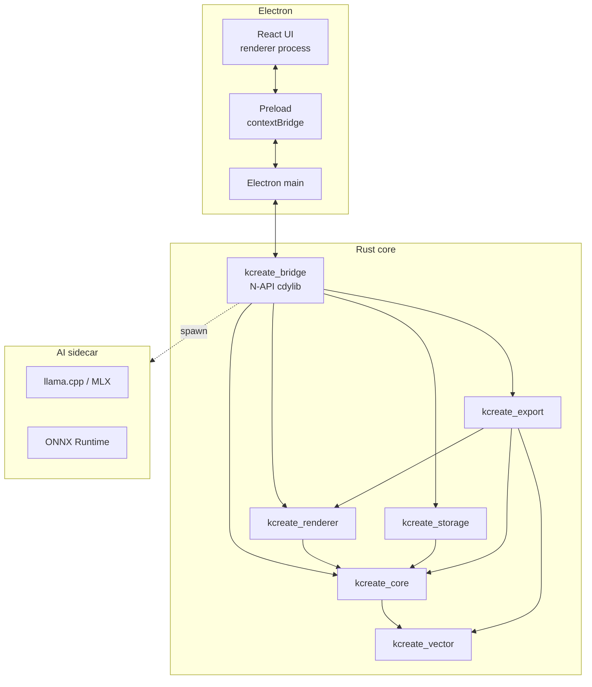

# KCreate — Technical Architecture

This document describes how KCreate is built. It is the technical
counterpart to `PROPOSAL.md` (product spec) and `PROGRESS.md` (shipping
status). When the architecture changes, this file is updated in the
same PR.

---

## 7. High-level architecture



## 8. Process model

KCreate runs in up to five distinct processes:

1. **Electron main** — owns the `BrowserWindow`, lifecycle, file dialogs,
   IPC handlers. Loads the Rust bridge via `process.dlopen`.
2. **Electron renderer** — React UI. No native code. Talks to the bridge
   exclusively through the preload-exposed `window.kcreate.*` API.
3. **Electron preload** — runs in a privileged Node context, uses
   `contextBridge.exposeInMainWorld` to expose a small typed surface.
4. **AI sidecar** (Phase 1+) — long-lived `llama.cpp` / MLX / ONNX
   process spawned on demand. Communicates over a local socket. Runs at
   a lower priority and is killable independently of the editor.
5. **Optional MCP server** (Phase 1+) — local-loopback server that
   exposes a permissioned set of editor tools to AI agents (Devin,
   Claude, local agents).

The renderer process never imports native code. The bridge cdylib lives
in the Electron main process only.

## 9. Electron ↔ Rust communication

Two channels, each tuned for its workload:

- **N-API (low-latency, blocking).** Renderer frames, scene updates,
  pointer events, and document CRUD. This path's round-trip is the
  pixel-readback + IPC pipeline — every microsecond matters.
- **Sidecar IPC (asynchronous).** AI model loads, inference, MCP tool
  calls. Long-running, cancellable, may stream tokens.

The N-API surface is strictly thin. All business logic lives in
`kcreate_bridge::state` and friends; `lib.rs` is a marshalling layer.

## 10. Canvas rendering

### Phase 0 — offscreen wgpu + readback

```
Scene (JSON) ──► kcreate_bridge::wire::parse_scene
                  │
                  ▼
            DisplayList build
                  │
                  ▼
        wgpu offscreen render
                  │
                  ▼
        GPU → CPU readback (triple-buffered)
                  │
                  ▼
        N-API Buffer → preload → ImageData → <canvas>
```

The Rust side owns the entire pipeline. The Electron renderer only
calls `ctx.putImageData(...)`. This guarantees we can replace the
presentation path without rewriting the pipeline.

### Phase 1 — native CanvasHost

Phase 1 replaces only the presentation path: a native child view obtained
via `raw-window-handle` becomes the wgpu surface, eliminating the
readback + IPC + `putImageData` round trip. The display list, scene
graph, viewport, dirty regions, and presenter remain unchanged.

## 11. Platform GPU backends

| Platform        | Primary    | Fallback        | Software       |
| --------------- | ---------- | --------------- | -------------- |
| macOS Intel     | Metal      | —               | `tiny-skia`    |
| macOS Apple Si  | Metal      | —               | `tiny-skia`    |
| Windows x64     | D3D12      | Vulkan          | `tiny-skia`    |
| Linux x64       | Vulkan     | OpenGL ES       | `tiny-skia`    |
| Linux arm64     | Vulkan     | OpenGL ES       | `tiny-skia`    |

`tiny-skia` is a real, production-grade software rasterizer. It runs
the same display list as the GPU backend; switching is transparent.

## 12. Shared document model

Conceptually:

```
Project
├── Pages
│   └── Artboards
│       └── Layers (group / vector / raster / text / component / layout-frame)
└── Brand kits, design tokens, export presets, operation log
```

### Internal node structure

Implemented in `kcreate_core::node::Node`:

```rust
pub struct Node {
    pub id: Uuid,
    pub node_type: NodeType,
    pub parent_id: Option<Uuid>,
    pub children: Vec<Uuid>,
    pub bounds: Bounds,
    pub transform: Transform2D,
    pub opacity: f32,
    pub blend_mode: BlendMode,
    pub visible: bool,
    pub locked: bool,
    pub name: String,
    pub style: NodeStyle,
    pub effects: Vec<Effect>,
    pub constraints: Constraints,
    pub metadata: HashMap<String, serde_json::Value>,
    pub version: u64,
}
```

`NodeType`, `BlendMode`, `Effect`, `NodeStyle`, `Constraints`,
`Transform2D`, and `Bounds` are described in `kcreate_core::node`. All
types are `Serialize` + `Deserialize` and round-trip cleanly through
JSON for IPC and SQLite persistence.

### Document graph

The document is a flat `HashMap<Uuid, Node>` with tree structure stored
via each node's `parent_id` and `children`. We learned from
`ux-open-pencil` that O(1) lookups by id are critical when an artboard
holds thousands of nodes; tree walks are only needed for explicit
traversal, hit-testing, and rendering.

### Operation log

Implemented in `kcreate_core::operation::OperationLog`. Every mutation
appends an `Operation`:

```rust
pub struct Operation {
    pub id: Uuid,
    pub timestamp: DateTime<Utc>,
    pub actor: String,
    pub command: String,
    pub before_patch: serde_json::Value,
    pub after_patch: serde_json::Value,
    pub affected_nodes: Vec<Uuid>,
    pub ai_generated: bool,
}
```

`undo` and `redo` move a position cursor over the history; a new
`push` truncates any redo-stack tail. Max-depth trimming bounds the log
to a configurable size (`RuntimeConfig::max_undo_depth`).

## 13. Local file format — `.kstudio/`

Native projects are folders, not opaque archives:

```
my-project.kstudio/
├── manifest.json          // format version, project id, timestamps
├── document.sqlite        // node tree + operation log + assets table
├── blobs/                 // content-addressed binary blobs (BLAKE3)
│   ├── ab/abcd123…blob
│   └── …
├── thumbnails/            // page thumbnails (PNG)
├── exports/               // user-exported files
├── ai/                    // AI action log (mirrored from SQLite)
└── cache/                 // ephemeral derived caches; safe to delete
```

The folder is transparent: any file manager shows its contents. The
SQLite database is encrypted at rest (Phase 1+ with SQLCipher).
Content-addressed dedup lets re-imports of the same asset cost zero
disk.

`manifest.json` format:

```json
{
  "version": "0.1.0",
  "name": "My Project",
  "id": "550e8400-e29b-41d4-a716-446655440000",
  "created_at": "2026-05-21T08:00:00Z",
  "modified_at": "2026-05-21T08:00:00Z",
  "format": "kstudio-v1"
}
```

## 14. Engine design

### Rendering pipeline

`kcreate_renderer::Pipeline`:

```
Scene ──► invalidate ──► dirty region tracker
       │                       │
       ├──► display list (with cache) ──► backend (GPU | CPU)
       │                                       │
       └── viewport (pan, zoom) ───────────────┘
                                               │
                                               ▼
                                         Presenter (triple-buffered)
```

### Raster tile engine (planned, Phase 1)

Tiles of 256×256 (configurable). Memory budget driven by
`RuntimeConfig::max_raster_cache_mb`. Tiles are produced lazily and
cached LRU; pan only invalidates uncovered regions.

### Vector engine

- **Path representation:** compact `Vec<PathSegment>` arrays in
  `kcreate_vector::path::VectorPath`. Closed paths are first-class
  (`closed: bool`); fill rule is explicit.
- **Spatial index:** R-tree from `rstar` in
  `kcreate_vector::spatial_index::VectorSpatialIndex`.
- **Boolean ops:** delegated to `i_overlay` for production-grade
  Greiner-Hormann polygon clipping in
  `kcreate_vector::boolean::boolean_operation`.
- **SVG import:** `usvg` parses the source; we walk the tree and emit
  `VectorPath`s with fills lifted into metadata.
- **SVG export:** `kcreate_vector::svg_export` produces clean,
  developer-friendly SVG with explicit `viewBox`, no superfluous
  groups, and compact path data.

### Text engine (planned, Phase 1)

Font discovery via system APIs (`CoreText`, DirectWrite, FontConfig).
Shaping with `rustybuzz`. Glyph atlas built lazily, GPU-uploaded once.

### Layout engine (planned, Phase 1)

Frame-level flex/grid. Constraint solver for responsive frames. Reuses
the dirty-region tracker so a single token change repaints only the
affected layers.

### CPU / GPU support by platform

| Platform        | wgpu  | tiny-skia | ONNX  | llama.cpp |
| --------------- | :---: | :-------: | :---: | :-------: |
| macOS Intel     |   ✅  |    ✅     |   ✅  |    ✅     |
| macOS Apple Si  |   ✅  |    ✅     |   ✅  |    ✅ (MLX)|
| Windows x64     |   ✅  |    ✅     |   ✅  |    ✅     |
| Linux x64       |   ✅  |    ✅     |   ✅  |    ✅     |
| Linux arm64     |   ✅  |    ✅     |   ✅  |    ✅     |

### Device performance tiers

Defined in `kcreate_core::config::DeviceTier` (selected by
`DeviceTier::from_system_info` — a pure function over
`SystemInfo { total_ram_mb, gpu_available, … }`):

| Tier   | RAM bound     | GPU required? | Behavior                                                      |
| ------ | ------------- | ------------- | ------------------------------------------------------------- |
| Tier 0 | `< 8 GB`      | No            | Low-resource mode forced. Undo depth 32. CPU rasterizer only. |
| Tier 1 | `≥ 8 GB`      | No            | Undo depth 128. GPU backend used if probed available, CPU fallback otherwise. AI models limited to ≤ 2 GB. |
| Tier 2 | `≥ 16 GB`     | **Yes**       | Undo depth 256. Full GPU pipeline. AI models up to 7 GB.       |
| Tier 3 | `≥ 32 GB`     | **Yes**       | Undo depth 1024. All features; larger model packs; multi-document. |

Selection rules, encoded directly in
[`DeviceTier::from_system_info`](../crates/kcreate_core/src/config.rs):

1. **RAM is the floor; GPU upgrades the ceiling.** RAM-only thresholds
   are evaluated top-down. A box with ≥ 16 GB but no usable GPU is
   classified Tier 1 (not Tier 2), because the GPU-dependent budgets
   for Tier 2+ assume a working GPU pipeline. The same machine with
   a discrete GPU is Tier 2.
2. **No minimum on Tier 0.** Anything that doesn't meet Tier 1's 8 GB
   threshold — including a host where the RAM probe failed and
   `total_ram_mb` is `0` — falls to Tier 0. Tier 0 stays usable on
   minimal hardware (the CPU rasterizer is in-tree and forbids
   `unsafe`), but defaults to low-resource mode.
3. **Apple Silicon counts as a "GPU".** `gpu_available` is set true
   on Apple Silicon by the host probe even for unified-memory
   systems, so an M-series Mac with ≥ 32 GB lands in Tier 3.

The decision is intentionally pure and unit-testable: the platform
probe lives in [`RuntimeConfig::detect`](../crates/kcreate_core/src/config.rs)
and produces `SystemInfo`; tier selection consumes it without
touching the OS. Tests construct `SystemInfo` directly to verify
the boundary cases (no-GPU/16 GB, GPU/8 GB, etc.).

### Low-resource mode

When detected (or explicitly enabled in `RuntimeConfig`):

- Disable hover previews and live filters.
- Reduce raster cache budget.
- Cap undo depth to 32 operations.
- Disable speculative thumbnails.
- Suspend background indexing.

## 16. Local AI architecture

```
┌───────────────────────────────────────────────────────────┐
│  Editor (Electron renderer)                               │
└──────────────────────────┬────────────────────────────────┘
                           │ AI Action request
                           ▼
                ┌────────────────────┐
                │  AI Task Router    │  (in kcreate_ai, future)
                └─────┬──────────────┘
                      │ chooses model pack
        ┌─────────────┼──────────────────┐
        ▼             ▼                  ▼
┌──────────────┐ ┌──────────────┐ ┌──────────────┐
│ Model Mgr    │ │  Tool Exec   │ │ Safety Layer │
│ (load/unload)│ │ (sandboxed)  │ │ (logging,    │
│              │ │              │ │  permissions)│
└──────┬───────┘ └──────┬───────┘ └──────┬───────┘
       │                │                │
       ▼                ▼                ▼
┌─────────────────────────────────────────────┐
│      AI Action Log (operation_log + ai/)     │
└─────────────────────────────────────────────┘
```

### Model packs (Phase 1+)

- **Core Pack** — small LLM, background removal (e.g. `u2net`), upscale.
- **Image Pro** — segmentation, inpainting, denoise.
- **Design Pro** — palette extraction, layout suggestions.
- **Generation** — diffusion model packs (opt-in due to size).

### MCP server

`kcreate_mcp` (Phase 1+) exposes a permissioned local-loopback MCP
server. Initial tools:

1. `list_artboards` — return artboard names + ids.
2. `create_node(parent_id, node_type, props)` — create a layer.
3. `export_artboard(id, format, path)` — export to file.

Permission model: every tool call surfaces a dialog the first time it
is invoked from a new client; the user can grant once / always / deny.
Granted permissions are scoped per project.

## 17. Plugin types and runtime (Phase 2+)

| Tier     | Runtime          | Capabilities                           | Trust                  |
| -------- | ---------------- | -------------------------------------- | ---------------------- |
| WASM     | wasmtime         | Pure functions, transforms             | Default; sandboxed.    |
| JS panel | Electron sandbox | Side panels, prompts, simple tools     | Signed; restricted IPC.|
| Native   | dynamic library  | Heavy lifting (image filters, codecs)  | Signed + user opt-in.  |

## 18. Resource optimization

- **Startup.** Lazy-load model packs; precompile no shaders we won't
  use; preload first artboard.
- **Memory.** Tile cache budget tied to `total_ram_mb`. Operation log
  trimmed to `max_undo_depth`. Layer thumbnails stored in
  `cache/`; safe to delete on disk pressure.
- **CPU.** `rayon` thread pool capped to physical cores − 1. Render
  thread is single-threaded; backends use parallel sub-passes.
- **GPU.** Single device, single queue. Triple-buffered readback ring.
- **Electron.** `webPreferences.sandbox: true` for renderer; preload
  exposes only typed methods; no `remote` module.

## Security and privacy

- Project data lives in `~/Documents/KCreate/projects/` (configurable).
- SQLite at rest is encrypted (Phase 1+, SQLCipher).
- No telemetry. No background uploads.
- AI actions are logged locally and visible in the History panel.
- MCP server is bound to loopback only.

## Crate architecture

```
crates/
├── kcreate_core/        # Shared types, node model, document graph, operation log, config
├── kcreate_renderer/    # offscreen wgpu pipeline + CPU fallback              [EXISTS]
├── kcreate_bridge/      # N-API cdylib (renderer + document + export IPC)    [EXISTS]
├── kcreate_vector/      # Path math, boolean ops, SVG import/export, R-tree
├── kcreate_storage/     # SQLite + content-addressed blob store + .kstudio I/O
└── kcreate_export/      # PNG and SVG export pipelines
```

Planned (Phase 1+):

```
crates/
├── kcreate_raster/      # tile engine, filters, masks
├── kcreate_text/        # font discovery, shaping, glyph atlas
├── kcreate_layout/      # page layout, master pages, flow
├── kcreate_ai/          # task router, model manager
├── kcreate_mcp/         # local MCP server
└── kcreate_audit/       # operation log persistence, AI action audit
```

### What is built vs. planned

| Concern                      | State    | Files                                                |
| ---------------------------- | -------- | ---------------------------------------------------- |
| GPU + CPU rendering pipeline | Built    | `crates/kcreate_renderer/src/*`                      |
| N-API bridge                 | Built    | `crates/kcreate_bridge/src/*`                        |
| Electron shell               | Built    | `apps/desktop/{main,preload,renderer}`               |
| Node + document graph        | Built    | `crates/kcreate_core/src/{node,document}.rs`         |
| Operation log                | Built    | `crates/kcreate_core/src/operation.rs`               |
| Project model                | Built    | `crates/kcreate_core/src/project.rs`                 |
| Runtime config / device tier | Built    | `crates/kcreate_core/src/config.rs`                  |
| SQLite schema + project I/O  | Built    | `crates/kcreate_storage/src/{schema,project_io}.rs`  |
| Blob store (BLAKE3)          | Built    | `crates/kcreate_storage/src/blobs.rs`                |
| Path + boolean + SVG         | Built    | `crates/kcreate_vector/src/*`                        |
| Spatial index                | Built    | `crates/kcreate_vector/src/spatial_index.rs`         |
| PNG / SVG export             | Built    | `crates/kcreate_export/src/{png,svg}.rs`             |
| Home / Editor pages          | Built    | `apps/desktop/renderer/src/pages/*`                  |
| AI sidecar                   | Planned  | `crates/kcreate_ai/*` (Phase 1)                      |
| MCP server                   | Planned  | `crates/kcreate_mcp/*` (Phase 1)                     |
| Raster tile engine           | Planned  | `crates/kcreate_raster/*` (Phase 1)                  |
| Text shaping                 | Planned  | `crates/kcreate_text/*` (Phase 1)                    |
| Layout engine                | Planned  | `crates/kcreate_layout/*` (Phase 2)                  |

### Recommended Rust dependencies

Already in the workspace: `wgpu`, `pollster`, `bytemuck`, `tiny-skia`,
`glam`, `parking_lot`, `crossbeam-channel`, `log`, `thiserror`,
`shared_memory`, `uuid`, `serde`, `serde_json`, `criterion`, `napi`,
`napi-derive`, `napi-build`.

Added in this phase:

| Crate       | Purpose                                                                 |
| ----------- | ----------------------------------------------------------------------- |
| `chrono`    | Timestamps with timezone awareness for operation log.                   |
| `rusqlite`  | SQLite (bundled feature, statically linked).                            |
| `blake3`    | Content-addressed hashing for the blob store.                           |
| `kurbo`     | Path math (Bezier evaluation, derivatives, lengths).                    |
| `i_overlay` | Production polygon Boolean operations.                                  |
| `usvg`      | SVG parsing.                                                            |
| `rstar`     | R-tree for spatial queries on layers.                                   |
| `image`     | PNG encoding for export.                                                |
| `sys-info`  | Cross-platform RAM and CPU probe for device tiering.                    |

Planned for Phase 1+:

| Crate         | Purpose                              |
| ------------- | ------------------------------------ |
| `rayon`       | Data-parallel filter passes.         |
| `resvg`       | Render SVG to raster for previews.   |
| `lopdf` / `printpdf` | PDF read / write.             |
| `rustybuzz`   | Text shaping.                        |
