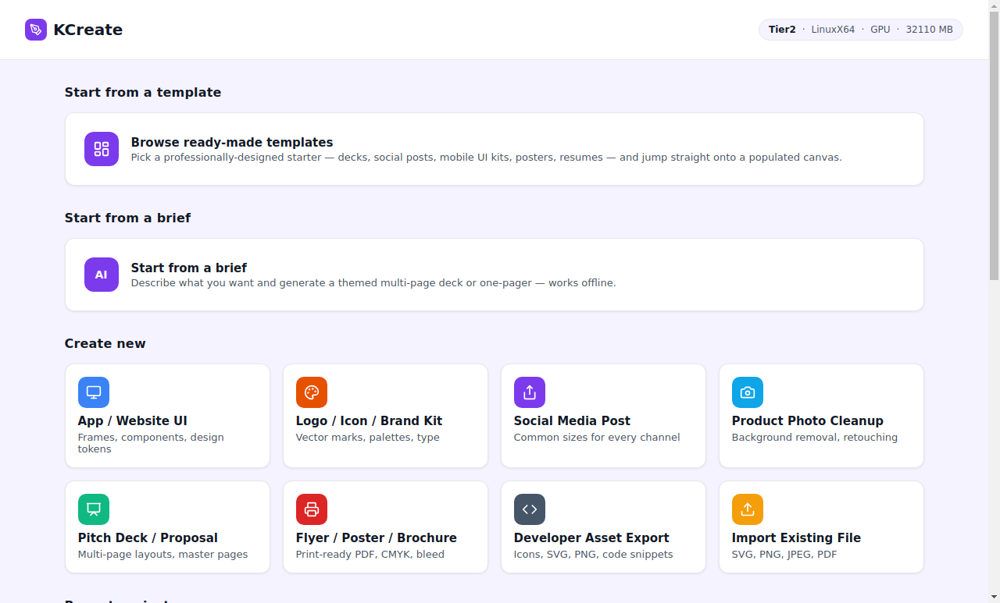
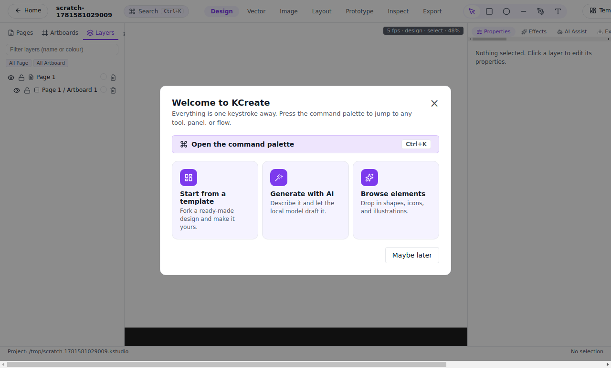
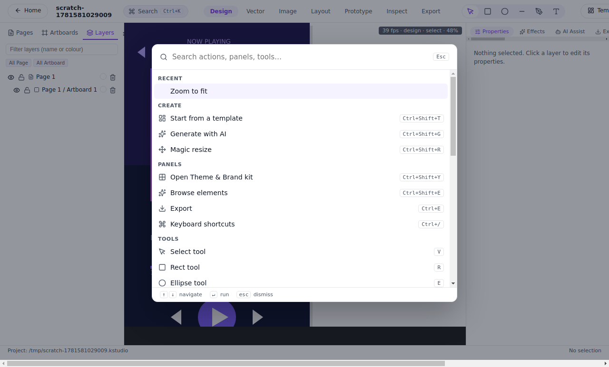
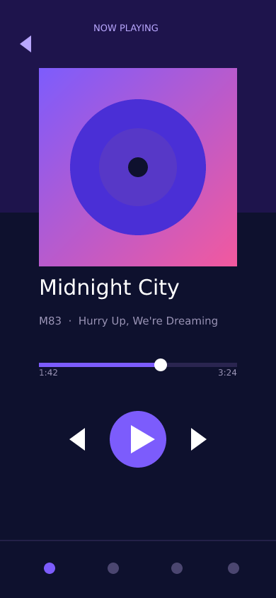

# 02 — From blank canvas to finished design

The fastest way to lose someone is to drop them on an empty artboard
with a wall of tools and no sense of what to do next. KCreate's
opening moments are designed around one question — *what are you
making?* — and around getting you to real pixels before you've had to
learn anything.

## The launcher asks what you're making

When KCreate opens, it doesn't open a blank document. It opens a
**launcher** organized around the job, not the file menu. You can
start from a ready-made template, import an existing file to keep
working, or describe what you want and let the app generate a first
draft.

*The launcher leads with intent: browse ready-made templates, open
recent work, import a file, or generate with AI.*

That choice — *intent first* — is deliberate. The launcher
([`apps/desktop/renderer/src/pages/HomePage.tsx`](../apps/desktop/renderer/src/pages/HomePage.tsx))
makes the "start from something good" paths the prominent ones, and
keeps recent projects one click away so returning to work is
frictionless.

## A first run that teaches by pointing, not by blocking

New users get a short, dismissible welcome that points at the things
worth knowing — the command palette, the template gallery, AI
generation — and then gets out of the way. It is gated in local
storage so it shows once and never nags.

Crucially, onboarding **points at real features** rather than running
a scripted tour you can't escape. When the canvas is empty, the empty
state itself offers the next move (start from a template, generate
with AI) instead of leaving you guessing.

## ⌘K: every action one keystroke away

Power comes from a single, fast **command palette** bound to
`Ctrl`/`Cmd`+`K`. It fuzzy-matches across every action, every panel,
and every create command, and it boosts the things you use most —
storing only `{id, count, lastUsed}` locally, never the text you
typed.

*One keystroke opens the palette; type a few letters to jump to any
action. (The small on-device performance HUD in the corner is covered
in Part 07.)*

Every row in the palette invokes the **same handler** the menu and
keyboard shortcut already use — there is no second, divergent code
path to keep in sync. The palette and shortcut registry live in the
renderer alongside the editor
([`apps/desktop/renderer/src/pages/EditorPage.tsx`](../apps/desktop/renderer/src/pages/EditorPage.tsx)),
and shortcuts are surfaced exhaustively in a keyboard-shortcuts panel
so nothing is hidden.

## Why this matters for the job

The combined effect is that the distance from *"I need a thing"* to
*"I'm editing the thing"* is a click or a keystroke:

- **Need a head start?** Browse templates (Part 03).
- **Want a full draft instantly?** Describe it and generate (Part 04).
- **Continuing yesterday's work?** It's in recents on the launcher.
- **Know what you want to do?** ⌘K and type it.

None of these require learning the tool first. The tool reveals itself
as you reach for it.

*Where it leads: a finished, pixel-precise mobile UI screen — type,
imagery, controls, and layout — all built in KCreate and rendered
through its own pipeline.*

## How this compares

- **Canva** also leads with templates and is very good at it; KCreate
  matches that intent-first launcher while keeping everything local and
  adding a keyboard-driven command palette for speed.
- **Figma**'s quick actions (the `Ctrl`/`Cmd`+`/` menu) are a power
  feature, but the product still opens into a file-and-canvas model
  aimed at people who already know what they're doing. KCreate puts the
  job-selection front door *before* the canvas.
- **Gamma** is intent-first for one output type (a deck/page from a
  prompt). KCreate's launcher covers that path and the
  template/import/continue paths from the same screen.

---

**Trace it in the code**

- Launcher / home: [`apps/desktop/renderer/src/pages/HomePage.tsx`](../apps/desktop/renderer/src/pages/HomePage.tsx)
- Editor, command palette, shortcuts, empty states: [`apps/desktop/renderer/src/pages/EditorPage.tsx`](../apps/desktop/renderer/src/pages/EditorPage.tsx)
- The public window API the UI calls: [`apps/desktop/preload/src/preload.ts`](../apps/desktop/preload/src/preload.ts)

Previous: [« 01 — Why a local-first design suite?](./part-01-why-local-first.md) ·
Next: [03 — A library that jump-starts the work »](./part-03-library-jump-start.md)
