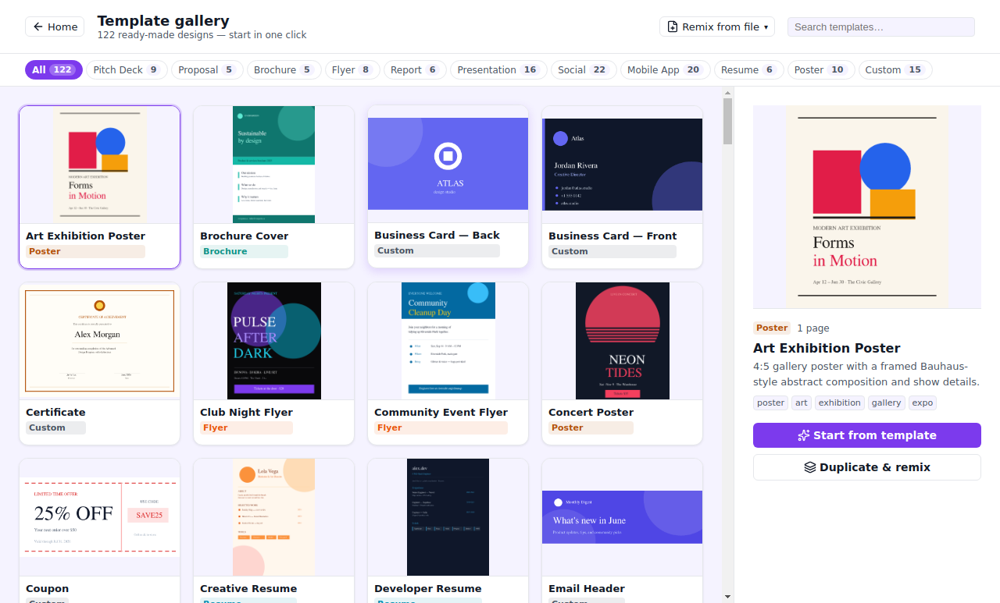
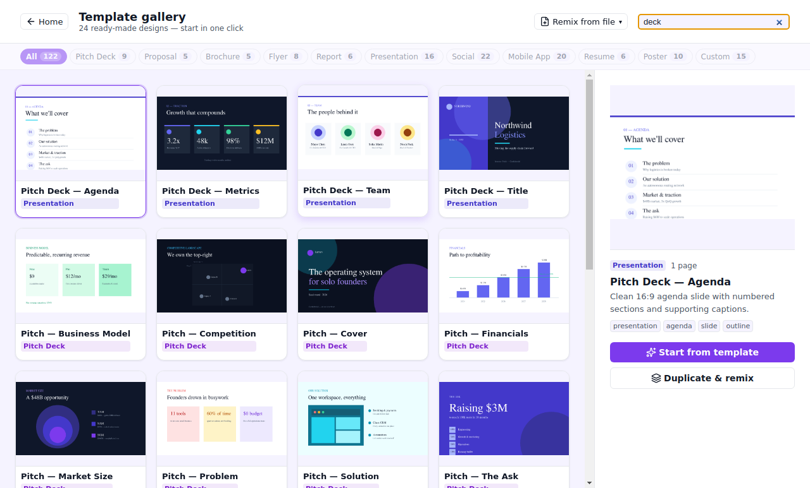

# 03 — A library that jump-starts the work

Nobody wants to start from an empty rectangle. The single biggest
reason people reach for Canva over a "real" design tool is the
library: thousands of designs that are already good, ready to make
your own. KCreate brings that jump-start on-device — and keeps every
piece of it **fully editable**, never a flattened placeholder.

## 122 ready-made templates, every one real

The launcher opens straight into a full-page gallery of **122
templates** spanning the things people actually make: mobile UI kits,
pitch and pricing decks, social posts and stories, posters and flyers,
résumés, reports, invoices, menus, and more. Categories carry live
counts, and a ranked search narrows the set as you type.

*The gallery is virtualized — only the visible rows mount — so 122
real layouts scroll smoothly. Each tile is a thumbnail rendered from
the template's actual content, cached to disk by content hash so it's
generated once.*

Every template is a real vector layout in `content.json`, not a
picture of a design. Pick one and you get editable text, shapes, and
images on the canvas — ready to restyle, recolor, and rearrange.
Search is ranked (exact name beats tag beats category), so typing
"deck" surfaces decks first.

## 417 elements you can search and recolor

Inside the editor, the asset library carries **417 elements** —
shapes, lines, arrows and connectors, a large set of outline and
filled icons, frames, dividers, badges, plus illustrations and chart
motifs. They're organized into sub-categories with a **ranked,
synonym-aware search** (so "next" finds arrows and chevrons), and
every element drops in as an editable `VectorLayer`.

The detail that makes the library feel native rather than
clip-arty: elements **recolor to your design on insert**. A monochrome
glyph adopts your theme/brand accent; a multi-color illustration
hue-rotates its chromatics while preserving neutrals. So the library
doesn't just give you a shape — it gives you a shape that already
looks like it belongs in *your* document.

## Bring your own — import and remix

The library isn't a walled garden. You can **import and remix** your
own work: an external `.kstudio` project, a `.ktemplate`, or document
JSON becomes a new library template you can stamp out repeatedly. The
`.kstudio` parsing happens in the bridge (reading the project's SQLite
index), and registration is format-agnostic in the pure-core
marketplace logic — so "my last deck" becomes "my deck template" in a
couple of clicks.

This is the JTBD payoff: the work you've already done is the best
starting point for the next thing, and KCreate treats it as a
first-class part of the library rather than a separate import dialog.

## How this compares

- **Canva**'s library is its superpower, and it's enormous — but it's
  cloud-hosted, and the line between "free" and "locked" assets is a
  constant papercut. KCreate's 122 templates and 417 elements ship
  *with the app*, work offline, and carry no per-asset entitlement
  checks.
- **Figma**'s Community is rich but oriented around files you copy into
  your account; recoloring and remixing are manual. KCreate recolors
  elements to your brand automatically on insert.
- **Gamma** gives you themed starting points for decks/pages
  specifically; KCreate spans the full range of output types and lets
  you turn any of your own files into a reusable template.

The library is the on-ramp. The next post covers the other on-ramp:
generating a whole design from a single sentence.

---

**Trace it in the code**

- Template gallery UI: [`apps/desktop/renderer/src/pages/HomePage.tsx`](../apps/desktop/renderer/src/pages/HomePage.tsx) and the gallery components in [`apps/desktop/renderer/src/components/`](../apps/desktop/renderer/src/components/)
- Bundled asset catalog (generated): [`crates/kcreate_core/`](../crates/kcreate_core/) and the assets panel in [`apps/desktop/renderer/src/components/`](../apps/desktop/renderer/src/components/)
- Vector elements as editable layers: [`crates/kcreate_vector/`](../crates/kcreate_vector/)
- Project / template storage (`.kstudio`): [`crates/kcreate_storage/`](../crates/kcreate_storage/)

Previous: [« 02 — From blank canvas to finished design](./part-02-blank-to-finished.md) ·
Next: [04 — Generate a whole design from a sentence »](./part-04-generate-from-a-sentence.md)
