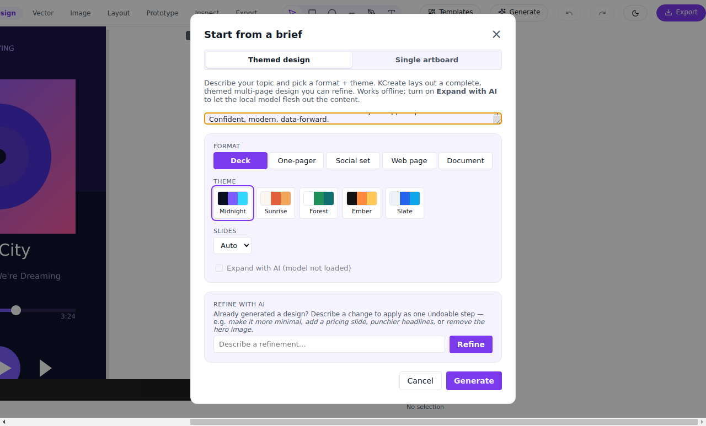
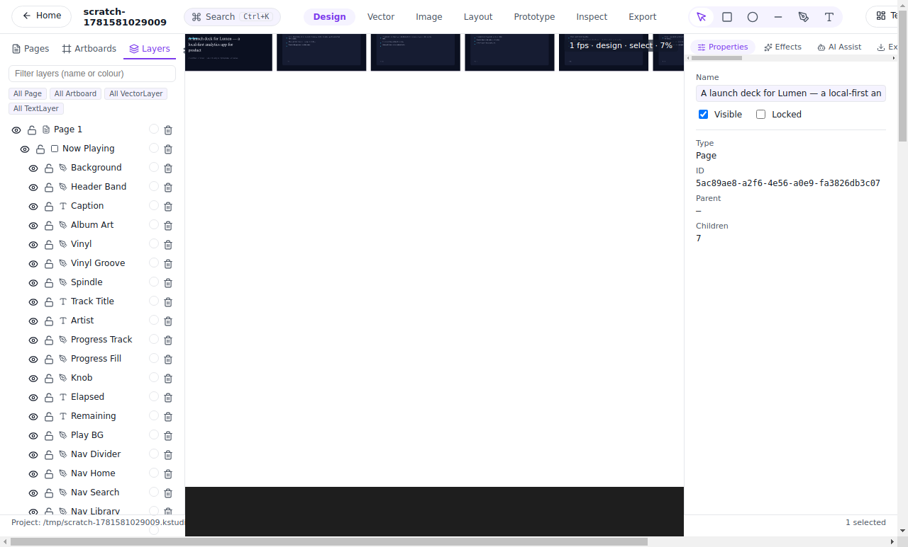
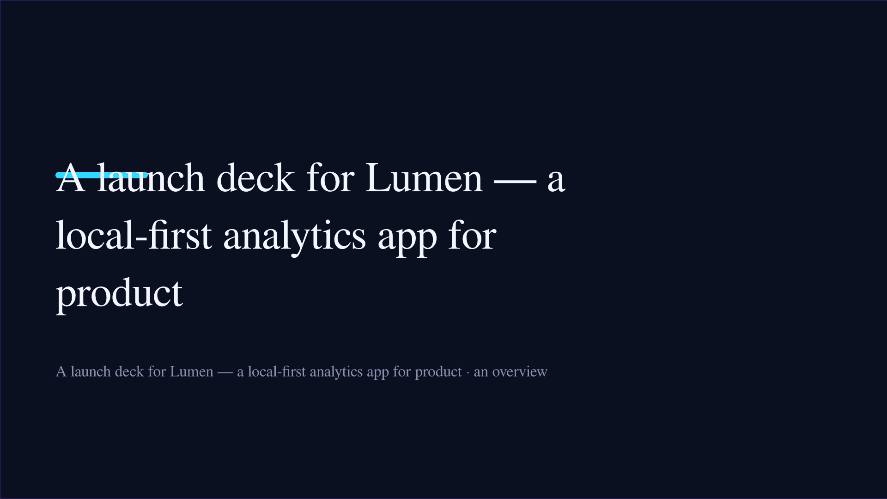

# 04 — Generate a whole design from a sentence

The most striking thing a modern design tool can do is turn a single
sentence into a finished first draft. Gamma made this the headline
feature for decks. KCreate does it for **decks, one-pagers, social
sets, web pages, and multi-page documents** — and it does it
**entirely on your device**, handing you real editable layers instead
of a flattened export.

## Describe it, get a draft

Open the AI brief, describe what you're making, pick a format and a
look, and generate. A few hundred milliseconds later you have a
complete, on-brand draft on the canvas.

*The brief lets you choose the format (deck, one-pager, social set,
web page, document) and the theme. It runs offline — no prompt leaves
the machine.*

Behind that modal is a **deterministic content planner** plus
per-format generators. Each format is its own generator with real
layout logic:

- **Deck** — a title slide plus content slides with consistent
  geometry.
- **One-pager** — a single dense, structured page.
- **Social set** — a 1:1 feed tile and a matching 9:16 story.
- **Web page** — a hero, feature cards, and a call-to-action.
- **Document** — a cover plus body pages that paginate greedily, with
  running headers and "Page n of m" footers.

The planner and generators live in the AI crate and the bridge's
generative module; because they're deterministic, the same brief is
reproducible, and layout geometry stays stable across runs while theme
and copy vary.

## It hands you a real, editable design

This is the difference that matters for the job. The output is not an
image — it's a new page of fully editable artboards, text frames,
shapes, and image placeholders that you can immediately refine.

*A generated deck, live in the editor — every slide is real artboards
and layers, ready to edit.*

*The title slide on its own, exported through the render pipeline.
Type, color, and layout are all editable objects, not baked pixels.*

## Hero imagery, honestly offline

When you want generated imagery (a hero photo for a web page, say),
KCreate renders it through the local image-generation sidecar **when a
model is installed and ready**. When no model is present, it degrades
to a tasteful gradient placeholder and tells you so with an honest
`usedImage` flag — it never silently pretends, and it never reaches
out to a cloud service to fill the gap. The model path stays behind a
feature flag so the editing-path dependency tree remains network-free.

## Refine with AI — and undo it in one step

A first draft is a starting point, so generation includes a **refine
loop**: give a free-text instruction ("make it warmer," "tighten the
copy"), and KCreate regenerates and reapplies the design. The entire
refinement is a **single undoable operation** — one `Ctrl`/`Cmd`+`Z`
reverts the whole thing by the original node ids, and redo restores it
verbatim. Nothing the AI does is irreversible; that contract is the
subject of Part 08.

## How this compares

- **Gamma** pioneered prompt-to-deck and does it beautifully — but it's
  a cloud service, and the result is comparatively hard to take into a
  precise editor. KCreate generates locally across five formats and
  hands you native, editable layers in the same app you'll finish in.
- **Canva**'s Magic Design is cloud-based and image-leaning. KCreate's
  generation is structural (real artboards and text), reproducible, and
  offline.
- **Figma**'s generative features are early and cloud-bound. KCreate's
  generate-then-refine loop is built around local models and a strict
  undo contract.

---

**Trace it in the code**

- AI brief / generate UI: [`apps/desktop/renderer/src/components/BriefModal.tsx`](../apps/desktop/renderer/src/components/BriefModal.tsx)
- Generative planner + format generators: [`crates/kcreate_ai/`](../crates/kcreate_ai/) and the generative module in [`crates/kcreate_bridge/src/`](../crates/kcreate_bridge/src/)
- Local image-generation sidecar: [`crates/kcreate_ai/src/llm_sidecar.rs`](../crates/kcreate_ai/src/llm_sidecar.rs)
- IPC + public API: [`apps/desktop/main/src/main.ts`](../apps/desktop/main/src/main.ts), [`apps/desktop/preload/src/preload.ts`](../apps/desktop/preload/src/preload.ts)

Previous: [« 03 — A library that jump-starts the work](./part-03-library-jump-start.md) ·
Next: [05 — Brand it once, apply it everywhere »](./part-05-brand-it-once.md)
