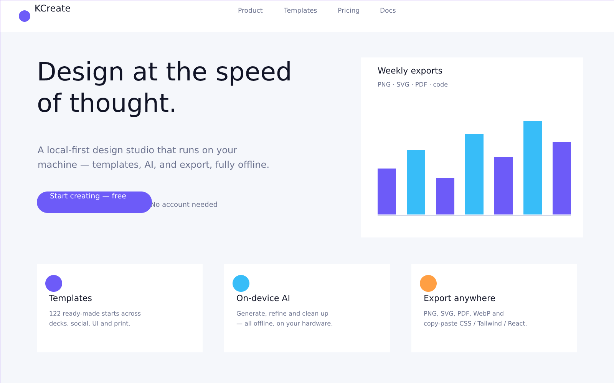
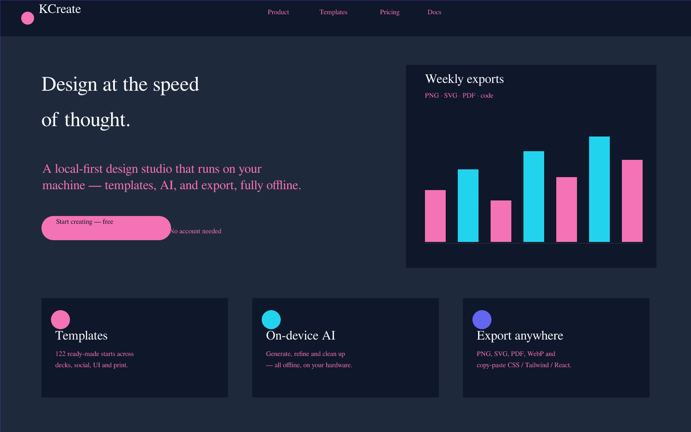

# 05 — Brand it once, apply it everywhere

Staying on-brand is mostly a chore: the same five colors, two
typefaces, and one logo, applied by hand across every artboard, every
project, forever. KCreate collapses that chore into a one-time setup
and a one-click apply — and, because it's local-first, your brand
system lives on your machine and follows you across projects without a
team subscription.

## Themes: restyle a whole design instantly

The fastest version of "make it on-brand" is a **theme**. KCreate
ships a set of cohesive themes (Midnight, Sunrise, Forest, Ember,
Slate), and applying one recolors fills and strokes and restyles text
across the design in a single, undoable step.

*The original design.*

*The same design, one click later, after applying the Midnight theme —
fills, strokes, and type all restyled coherently. This is a real
before/after captured from the app: applying Midnight here recolored
dozens of fills and restyled the headings to a serif treatment on a
deep navy ground.*

Themes can apply to the **whole document** or just the **current
selection**, so you can rebrand everything at once or retheme one
section without touching the rest.

## Brand kits: your colors, type, and logo, everywhere

A theme is a look; a **brand kit** is *your* look. A brand kit captures
your palette, typography, and logo as a reusable system that lives
across projects — not locked to a single file. KCreate lets you:

- **Build a kit** from scratch, or **derive one** automatically from an
  existing document or from an image (it extracts a coherent palette
  via on-device k-means).
- **Import a palette** and bring in **custom fonts**, which are
  **embedded on export** so your output looks right on machines that
  don't have those fonts installed.
- **Place your logo** as a real asset and **apply the kit** to a
  selection or the whole document.

Because brand kits are stored locally and shared across projects, the
brand you set up once is available in every new design you start —
there's no "share to team library" round-trip, and it all works
offline.

## Why this serves the job

The job isn't "pick colors." The job is "make this look like us,
quickly, every time." KCreate's theme + brand-kit pairing means:

- a brand-new generated draft (Part 04) can be themed to your brand in
  one click;
- a template from the library (Part 03) inherits your palette and type
  the moment you apply your kit;
- and a one-off section can be restyled without disturbing the rest of
  the page.

## How this compares

- **Canva**'s Brand Kit is the model here, and it's very good — but it's
  a paid, cloud-hosted feature tied to a Canva account and team. KCreate
  gives you cross-project brand kits on-device, including deriving a kit
  from an image and embedding custom fonts on export.
- **Figma**'s styles and variables are powerful and precise, but they
  live inside a file/library and assume the cloud document model.
  KCreate's kits travel with you across local projects.
- **Gamma** applies themes to generated content well; KCreate applies
  themes *and* full brand systems to anything — generated, templated, or
  hand-built.

---

**Trace it in the code**

- Theme + brand-kit logic: [`crates/kcreate_bridge/src/`](../crates/kcreate_bridge/src/) (theme / brand modules) and core project model [`crates/kcreate_core/src/project.rs`](../crates/kcreate_core/src/project.rs)
- Palette extraction (k-means): [`crates/kcreate_ai/src/palette.rs`](../crates/kcreate_ai/src/palette.rs)
- Theme / brand UI panels: [`apps/desktop/renderer/src/components/`](../apps/desktop/renderer/src/components/)
- Font embedding on export: [`crates/kcreate_export/`](../crates/kcreate_export/) + [`crates/kcreate_text/`](../crates/kcreate_text/)

Previous: [« 04 — Generate a whole design from a sentence](./part-04-generate-from-a-sentence.md) ·
Next: [06 — One design, every size »](./part-06-one-design-every-size.md)
