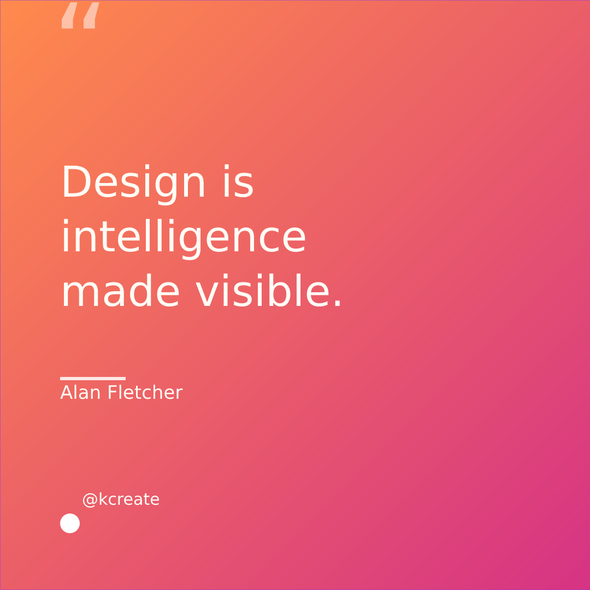
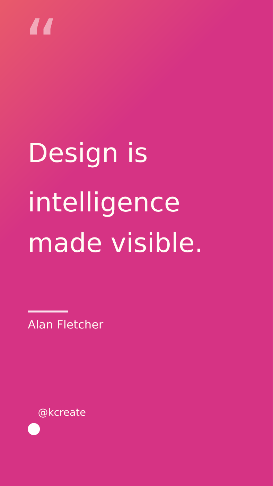
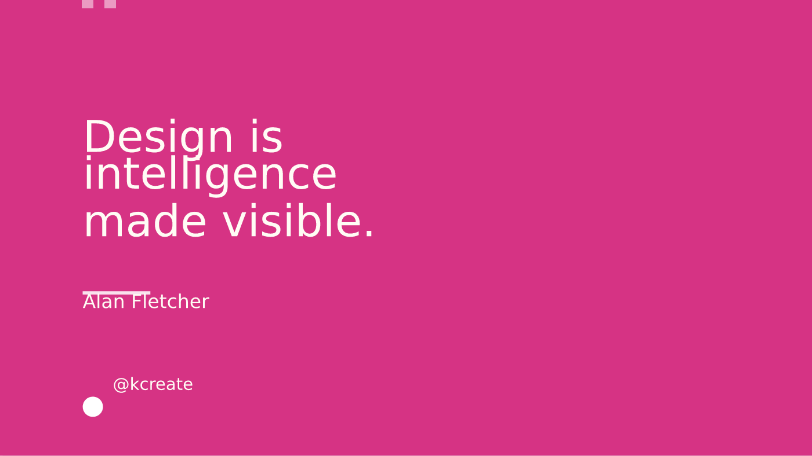
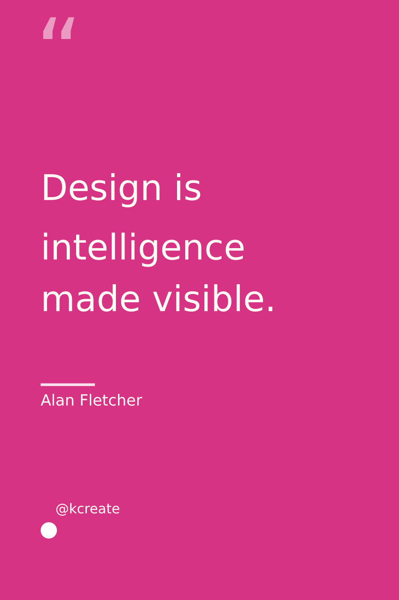

# 06 — One design, every size

You made the perfect square post. Now you need a story, a banner, a
pin, and a presentation slide — same idea, five aspect ratios. This is
one of the most repetitive jobs in all of design, and it's where
"resize" tools usually fall down: they stretch, they crop badly, or
they leave text overflowing its box. KCreate's **magic resize** is
built to produce results you'd actually ship.

## Resize that re-fits, not just rescales

Start from one design and target a set of sizes. KCreate does three
things that ordinary scaling doesn't:

1. **Anchor-aware layout.** Elements reflow according to their anchors,
   so a header stays pinned to the top and a footer to the bottom
   rather than everything scaling uniformly.
2. **Content-aware text re-fit.** A headline that no longer fits its
   reflowed box is shrunk back to fit using real text shaping — floored
   at a minimum size, never exceeding the geometric size — so type
   stays inside its frame instead of overflowing or clipping.
3. **Image smart-crop.** Photos are cropped around their most salient
   region (a center-weighted saliency pass over edge energy), baked
   into a fresh content-addressed blob so the source image is never
   distorted or destroyed — degrading gracefully to a center crop.

The text re-fit lives in [`crates/kcreate_text/`](../crates/kcreate_text/)
(real shaping, not a heuristic guess), and the focal crop is an
offline pass in [`crates/kcreate_ai/`](../crates/kcreate_ai/).

## One source, every format — exported in one shot

The payoff is batch export. Take a single source design and produce
every size at once:

*The source: a 1:1 social card.*

*Re-fit to a 9:16 story — note the layout reflows and the type stays
inside its box.*

*The same design as a 16:9 presentation slide.*

*And as a 2:3 pin.*

"Resize & export all" runs the resize **once** as a single undoable
operation, then renders every target to PNG **in parallel** into one
folder — so producing a full set of platform sizes is one action, not
five exports. The parallel render driver is
[`crates/kcreate_export/src/batch.rs`](../crates/kcreate_export/src/batch.rs),
and rendering happens off the Electron main thread so the UI never
freezes during a big batch.

## Why this serves the job

A campaign isn't one image — it's the same idea across every surface.
KCreate's magic resize turns "redo this layout five times" into "pick
the sizes, click once," with output that respects your layout and
keeps your type legible. That's hours back on every campaign.

## How this compares

- **Canva**'s Magic Resize is the benchmark and a paid feature; KCreate
  matches the one-click multi-size workflow on-device and adds
  content-aware text re-fit and saliency-based image cropping, then
  batch-exports every size in parallel.
- **Figma** has no native multi-size resize; you'd build it by hand or
  with a plugin. KCreate makes it a first-class action.
- **Gamma** is format-specific (decks/pages) and doesn't target the
  social/print size matrix; KCreate covers the full set.

---

**Trace it in the code**

- Content-aware text re-fit: [`crates/kcreate_text/`](../crates/kcreate_text/)
- Image smart-crop (focal saliency): [`crates/kcreate_ai/`](../crates/kcreate_ai/)
- Parallel batch export: [`crates/kcreate_export/src/batch.rs`](../crates/kcreate_export/src/batch.rs)
- Resize UI + IPC: [`apps/desktop/renderer/src/components/`](../apps/desktop/renderer/src/components/), [`apps/desktop/main/src/main.ts`](../apps/desktop/main/src/main.ts)

Previous: [« 05 — Brand it once, apply it everywhere](./part-05-brand-it-once.md) ·
Next: [07 — Pixel-perfect on every backend »](./part-07-pixel-perfect-rendering.md)
