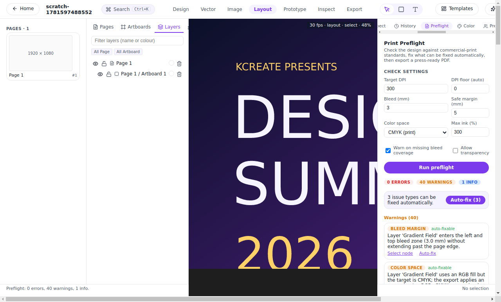

# 09 — Print-ready and developer-ready output

A design isn't done when it looks right on screen — it's done when it
reaches the next person in the chain in the form *they* need. For a
printer, that's a CMYK PDF with bleed, trim marks, and a checked ink
budget. For a developer, that's precise CSS, Tailwind, or React.
KCreate's Export Center is built to hand off cleanly to both, without a
separate tool.

## One Export Center, every format

KCreate exports **PNG, SVG, PDF, WebP, and JPEG** from the same Rust
pipeline that draws the canvas, so what you export is exactly what you
see (Part 07). Raster exports supersample at high DPI rather than
padding, so a 2× PNG is genuinely twice the detail. The export crate
([`crates/kcreate_export/`](../crates/kcreate_export/)) also drives the
parallel batch export behind magic resize (Part 06).

## Print-ready: preflight before you commit

Print is where on-screen designs quietly go wrong — RGB colors that
can't be printed, no bleed, too much ink, content crammed against the
trim, images below usable resolution. KCreate's **preflight**
([`crates/kcreate_export/src/preflight.rs`](../crates/kcreate_export/src/preflight.rs))
inspects a design before export and reports concrete, actionable
findings:

- **Color mode** — RGB content that needs CMYK conversion.
- **Bleed and trim** — content that doesn't extend into the bleed, an
  empty bleed area, or elements sitting inside the **safe margin** too
  close to the cut edge.
- **Ink coverage (TIC)** — total ink over the press limit.
- **Spot inks** — a spot color referenced on the page that isn't
  registered, and overprint/registration risks where adjacent inks
  share no plate.
- **Resolution** — raster images below a usable DPI for the print
  size.

## Fix-and-pass, not fix-and-hope

Findings are only half the value — KCreate also **fixes them for you
and re-checks**. The autofix pass
([`crates/kcreate_bridge/src/phase2.rs`](../crates/kcreate_bridge/src/phase2.rs),
`preflight_autofix`) walks the reported issues, applies the safe
corrections it can make — extend full-bleed content into the bleed
margin, fill an empty bleed area, convert sRGB fills to CMYK, bring
total ink back under the limit — then runs preflight again and returns
the issues that remain. A poster that comes in failing a dozen checks
goes out **clean**, and anything that genuinely needs a human decision
is reported with specific guidance instead of being silently "fixed."

Crucially, the autofix is applied as a **single undoable operation**
through the same operation log as every other edit (Part 08), so you
can preview the corrected design, keep it, or revert the whole pass
with one undo.


*An event poster built in KCreate — gradients and all — preflighted and
auto-corrected before it goes to the press.*

## A real press PDF: bleed, trim marks, and separations

Once a design passes, KCreate writes a genuine **press-ready PDF**
([`crates/kcreate_export/src/pdf_print.rs`](../crates/kcreate_export/src/pdf_print.rs)),
not just an RGB screen export renamed `.pdf`:

- The page bounds define the **trim**; full-bleed content flows into a
  **bleed** margin instead of being clipped.
- The media box adds room for **trim (crop) marks** and **registration
  targets** in the slug area, so the printer can align and cut.
- Output is **CMYK**, with rasters dithered to CMYK and gradients
  emitted in print color.
- Each **spot ink** on the page becomes a real `/Separation` plate, so
  a Pantone or varnish lands on its own plate rather than being
  flattened into process color.

That's the difference between a file a printer can run and a file they
have to send back.



*The preflight panel on a real design: concrete findings, an autofix
pass that brings them to zero, and a press PDF with bleed and trim
marks.*

## Developer-ready: inspect-mode code-gen

For the hand-off to engineering, KCreate's **inspect mode** generates
real code for any layer — the same job Figma's inspect panel does, but
running locally
([`crates/kcreate_export/src/code_gen.rs`](../crates/kcreate_export/src/code_gen.rs)).
Select an element and KCreate emits CSS, Tailwind, and a React inline
style object. Here's the actual output for a call-to-action button from
one of the designs in this series:

**CSS**

```css
position: absolute;
left: 124px;
top: 500px;
width: 244px;
height: 56px;
background-color: #6d5bf8;
```

**Tailwind**

```
w-[244px] h-[56px] absolute left-[124px] top-[500px] bg-[#6d5bf8]
```

**React (inline style)**

```jsx
{
  position: "absolute",
  left: 124,
  top: 500,
  width: 244,
  height: 56,
  backgroundColor: "#6d5bf8",
}
```

That's copy-paste-ready: exact geometry, exact color, in the
developer's choice of three idioms — generated on-device, no account or
plugin required.

## Why this serves the job

The job ends at the hand-off. A design that can't be printed correctly
or can't be implemented faithfully isn't finished. KCreate closes both
loops in the same app: preflight catches print problems *before* they
cost a reprint, autofix turns a failing file into a clean one in a
single undoable step, and code-gen gives developers exact values
instead of eyeballed approximations — so the thing that ships matches
the thing you designed.

## How this compares

- **Figma**'s Dev Mode is the benchmark for code hand-off and it's
  excellent — but it's cloud-bound and lacks real print preflight.
  KCreate generates the same class of CSS/Tailwind/React locally *and*
  adds CMYK/bleed/TIC/DPI/safe-margin preflight with an autofix pass
  and true spot separations.
- **Canva** and **Gamma** are weak on both precise print preflight and
  developer code hand-off; that's not their job. KCreate treats both as
  first-class.
- **Scribus** does serious print preflight but nothing for developers;
  KCreate brings print and developer hand-off under one roof — and adds
  the fix-and-pass loop on top.

---

**Trace it in the code**

- Export pipeline (PNG/SVG/PDF/WebP/JPEG): [`crates/kcreate_export/`](../crates/kcreate_export/)
- PDF preflight (CMYK / bleed / TIC / DPI / safe margin / spot): [`crates/kcreate_export/src/preflight.rs`](../crates/kcreate_export/src/preflight.rs)
- Preflight autofix (fix-and-pass, undoable): [`crates/kcreate_bridge/src/phase2.rs`](../crates/kcreate_bridge/src/phase2.rs)
- Press-ready PDF (bleed, trim/registration marks, spot separations): [`crates/kcreate_export/src/pdf_print.rs`](../crates/kcreate_export/src/pdf_print.rs)
- Inspect-mode code-gen (CSS / Tailwind / React): [`crates/kcreate_export/src/code_gen.rs`](../crates/kcreate_export/src/code_gen.rs)
- Export + preflight UI: [`apps/desktop/renderer/src/components/PreflightPanel.tsx`](../apps/desktop/renderer/src/components/PreflightPanel.tsx)

Previous: [« 08 — Intelligence that stays on your device](./part-08-on-device-intelligence.md) ·
Next: [10 — Extend and automate without the cloud »](./part-10-extend-and-automate.md)
