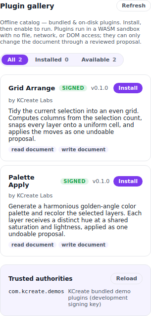
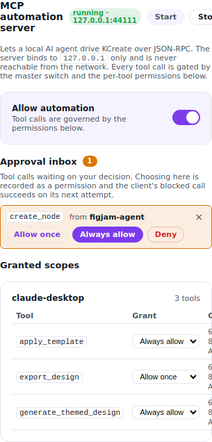

# 10 — Extend and automate without the cloud

A design tool becomes a platform when other people — and other
programs — can safely build on it. KCreate opens up two extension
surfaces, and both honor the same rule as the rest of the app: they
run **locally**, sandboxed, with no implicit access to your machine or
the network. You can extend KCreate with plugins and automate it with
an AI agent, all without anything leaving your device.

## Plugins: a real in-app marketplace

KCreate has a browsable **plugin gallery** built into the app
([`apps/desktop/renderer/src/components/PluginManager.tsx`](../apps/desktop/renderer/src/components/PluginManager.tsx)).
It lists bundled and on-disk plugins together, filterable by **All /
Installed / Available**, and lets you **install, enable, disable, and
remove** plugins without leaving the editor or touching a website. Each
row shows what the plugin is and what it can touch — a WASM badge, a
**signed / unsigned** trust badge, and permission pills — so the
decision to run it is informed, not a leap of faith.

KCreate ships **two real demo plugins** so the surface isn't
theoretical — `grid_arrange` (snaps selected layers onto a tidy grid)
and `palette_apply` (recolors a selection to a palette), both compiled
to `wasm32`, signed, and run in the sandbox through the host ABI. They
do real work on a real document, the same way a third-party plugin
would.

*The plugin gallery — browse, install, and enable WASM plugins with
their trust and permission state shown up front.*

## Sandboxed WASM, deny-by-default

Under the gallery, KCreate plugins are **WebAssembly modules** run in a
sandbox ([`crates/kcreate_plugin/`](../crates/kcreate_plugin/)) built on
`wasmi`. The security model is deny-by-default: a plugin gets a small,
explicit host ABI and **nothing else** — no filesystem, no network, no
DOM. The host functions it can call are deliberately minimal:

- a logging call,
- input/output passing (`kcreate_get_input`, `kcreate_set_output`),
- and an extended document ABI for real design work:
  `kcreate_read_document`, `kcreate_read_asset`, and
  `kcreate_write_proposal`.

That last one matters: a plugin doesn't mutate your document directly —
it **writes a proposal**. KCreate folds a plugin's whole batch of
proposals into a single `plugin_apply_proposals` operation that flows
through the same operation log as everything else, so a plugin's
changes are previewable and **undoable in one step**, exactly like an
AI action (Part 08). A page-count `ResourceLimiter` caps how much
memory a plugin can allocate, so a misbehaving module can't exhaust
your machine.

## Trust you can verify: signed manifests

Plugins carry **Ed25519-signed manifests**. Signing means you can
verify a plugin is what it claims to be and hasn't been tampered with,
and KCreate keeps a list of **trusted authorities** (public keys) you
recognize. A plugin signed by a trusted key and asking only for safe
permissions enables in one click; enabling an **unsigned or
over-broad** plugin requires explicit **consent through a modal** that
spells out exactly what you're granting. The trust decision is yours
and it's deliberate — never something that happens silently in the
background.

## Automation: a loopback MCP server an agent can drive

KCreate also speaks **MCP (Model Context Protocol)** over a
**loopback-only** server ([`crates/kcreate_mcp/`](../crates/kcreate_mcp/)),
so an external AI agent on your machine can drive the app
programmatically. The toolset is broad enough to produce real work
end-to-end — an agent can list and apply templates, generate a themed
design, list and insert library assets, set fills and text, list and
apply themes, run magic resize, list artboards, create nodes, and
export the result to PNG / SVG / PDF. Every one of those tools executes
through the **same document operation path** as the UI, so an agent's
actions are undoable and persisted just like yours. Because the server
binds to `127.0.0.1` only, the automation surface is reachable by tools
on your machine and **nothing else**.

To prove it isn't theoretical, KCreate includes a small, dependency-free
agent ([`tools/mcp-demo-agent/`](../tools/mcp-demo-agent/)) that
connects over MCP and composes a recognizable poster purely through
tool calls, then exports it — the same flow a third-party AI assistant
would use.

## Permission you actually control

Every MCP capability is **permission-gated**. A `McpPermissionStore`
mediates each tool call with an explicit **Once / Always / Denied**
decision at `(client, tool)` granularity, persisted to disk
([`crates/kcreate_mcp/src/permissions.rs`](../crates/kcreate_mcp/src/permissions.rs)
+ the MCP settings panel in the renderer). Calls with no decision on
record surface as a **pending prompt** rather than running, and a
prominent **master kill-switch** pauses *all* automation at once
regardless of individual grants. You can review what each client has
been granted and **revoke** it. An agent can't quietly take actions you
haven't authorized — you grant access deliberately, per tool, and can
withdraw it just as deliberately.

*The MCP settings panel — per-tool grants, a pending-approval inbox, and
a one-switch pause for all automation.*

## Why this serves the job

Extension and automation are how a tool grows past its built-in
features without growing past your control. Whether it's a teammate's
plugin or an AI agent batch-producing a hundred variations, KCreate
keeps the same promises: sandboxed, explicit-permission, undoable, and
local. You get the leverage of a platform without surrendering the
ownership and privacy that make KCreate local-first in the first place.

## How this compares

- **Figma**'s plugin ecosystem is large and powerful, but plugins run
  with broad capabilities and the platform is cloud-anchored. KCreate's
  WASM sandbox is deny-by-default, signed, and routes changes through an
  undoable proposal log.
- **Canva** apps are cloud-hosted and reviewed by Canva; KCreate
  plugins run locally on your machine under your control.
- **MCP automation** of a design tool — letting a local AI agent drive
  the app under per-tool permissions, a kill-switch, and revocation,
  with every action undoable — is something the cloud incumbents don't
  offer in this form, because it presumes the tool and the agent share
  *your* machine.

---

**Trace it in the code**

- Plugin gallery / marketplace UI: [`apps/desktop/renderer/src/components/PluginManager.tsx`](../apps/desktop/renderer/src/components/PluginManager.tsx)
- WASM plugin sandbox + host ABI + signed manifests + demo plugins: [`crates/kcreate_plugin/`](../crates/kcreate_plugin/)
- Undoable plugin proposals (`plugin_apply_proposals`): [`crates/kcreate_bridge/src/document.rs`](../crates/kcreate_bridge/src/document.rs)
- Loopback MCP server + tools: [`crates/kcreate_mcp/`](../crates/kcreate_mcp/) (`src/tools.rs`)
- MCP permission store (Once / Always / Denied + kill-switch): [`crates/kcreate_mcp/src/permissions.rs`](../crates/kcreate_mcp/src/permissions.rs)
- A dependency-free MCP agent that builds a poster: [`tools/mcp-demo-agent/`](../tools/mcp-demo-agent/)
- Plugin / MCP UI panels: [`apps/desktop/renderer/src/components/`](../apps/desktop/renderer/src/components/)

Previous: [« 09 — Print-ready and developer-ready output](./part-09-print-and-dev-ready-output.md) ·
Back to the [series index »](./README.md)
