# Brewline v2 — KCreate end-to-end demo

This is the **second-pass** Brewline Coffee demo. It re-runs the same
seasonal-autumn-menu scenario as the original [`docs/demo/brewline`](../brewline)
walkthrough, but exercises the UI polish landed in PR
[#31](https://github.com/kennguy3n/KCreate/pull/31):

- **Track 1 — Lucide SVG icons.** Every action button, tool selector,
  tab strip, layer chip, and HomePage card now wears a real Lucide icon
  (`currentColor`-tinted, theme-aware) instead of a single-character
  Unicode glyph or text-only label.
- **Track 2 — template scaffolding.** Clicking a HomePage card lands
  the user in an editor that already has **named, palette-coloured,
  positioned seed content** on the canvas instead of an empty white
  page. Six resolvers cover every shipped template
  (`BRAND` / `SOCIAL` / `PRINT` / `APP_UI` / `PHOTO` / `DECK` /
  `DEV_EXPORT`).

The scenario, constraints, and entry-points are unchanged from v1:
local-only, CPU-only, headless Linux VM, no GPU acceleration, no
network calls from the editing path. Every artifact in this demo
was produced by the shipped Rust export pipeline on the same
hardware profile the original demo ran on.

## Scenario

Brewline Coffee (fictional indie chain) wants to ship a seasonal
**autumn menu push** across three surfaces in one afternoon:

| Surface                | Template card                  | Output                          |
| ---------------------- | ------------------------------ | ------------------------------- |
| Brand identity refresh | `Logo / Icon / Brand Kit`      | 1024×1024 brand kit canvas      |
| Instagram launch post  | `Social Media Post`            | 1080×1080 IG-square layout      |
| In-store A4 menu       | `Flyer / Poster / Brochure`    | A4 @ 300 DPI print-ready PDF    |
| Web hero (responsive)  | `App / Website UI`             | 1440×900 app-shell layout       |
| Investor deck slide    | `Pitch Deck / Proposal`        | 1920×1080 slide with two cols   |

The Brewline palette (`espresso #3E2723`, `cream #FFF8E1`,
`burnt orange #E65100`, `sage #689F63`, `paper #FAFAFA`, `ink #1B1B1B`)
ships with `BRAND_PALETTE` in `apps/desktop/renderer/src/lib/templates.ts`
and is what the BRAND / SOCIAL / PRINT resolvers paint with.

## Updated demo steps

The v1 demo opened a blank artboard and the operator had to hand-place
every shape and text node. v2 lets you skip straight to "now make it
yours" because the resolvers seed the structural starting point.

### 1. Launch and inspect HomePage

```bash
cd apps/desktop && pnpm start
```

The HomePage renders with eight tinted-square Lucide icon badges
(`monitor`, `palette`, `image`, `camera`, `presentation`, `printer`,
`code`, `upload`) plus an `AI` brief tile. No more text-only cards.


### 2. Click `Logo / Icon / Brand Kit`

The editor opens on the 1024×1024 `Logo` artboard with **12 named seed
nodes** already laid down by `BRAND_RESOLVER.apply()`:

- `Brand title` (64pt, espresso)
- `Tagline` (24pt, espresso)
- Four `Palette / <colour>` swatches (Espresso / Cream / Burnt orange / Sage), each 214×214px
- Four `Swatch label / <colour>` text nodes below each swatch
- `Logo placeholder` (espresso, 164×164px) anchored bottom-left
- `Logo caption` ("Drop your mark here")

The **Layers panel** on the left is the most direct visual proof:

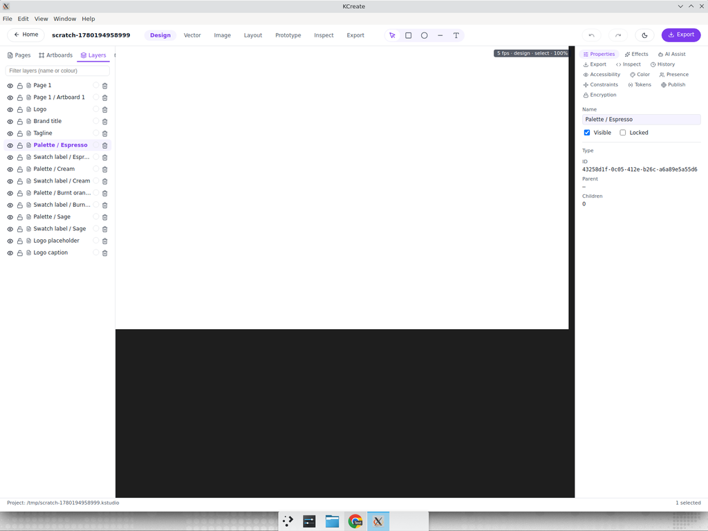

### 3. Verify seeded geometry via Inspect mode

Switch to **Inspect** mode (top tab) and click any palette swatch.
The right panel emits the live `CSS` / `Tailwind` / `React style`
for the selected node — directly from the Rust `kcreate_export::code_gen`
crate.

| Format       | Output                                                         |
| ------------ | -------------------------------------------------------------- |
| CSS          | 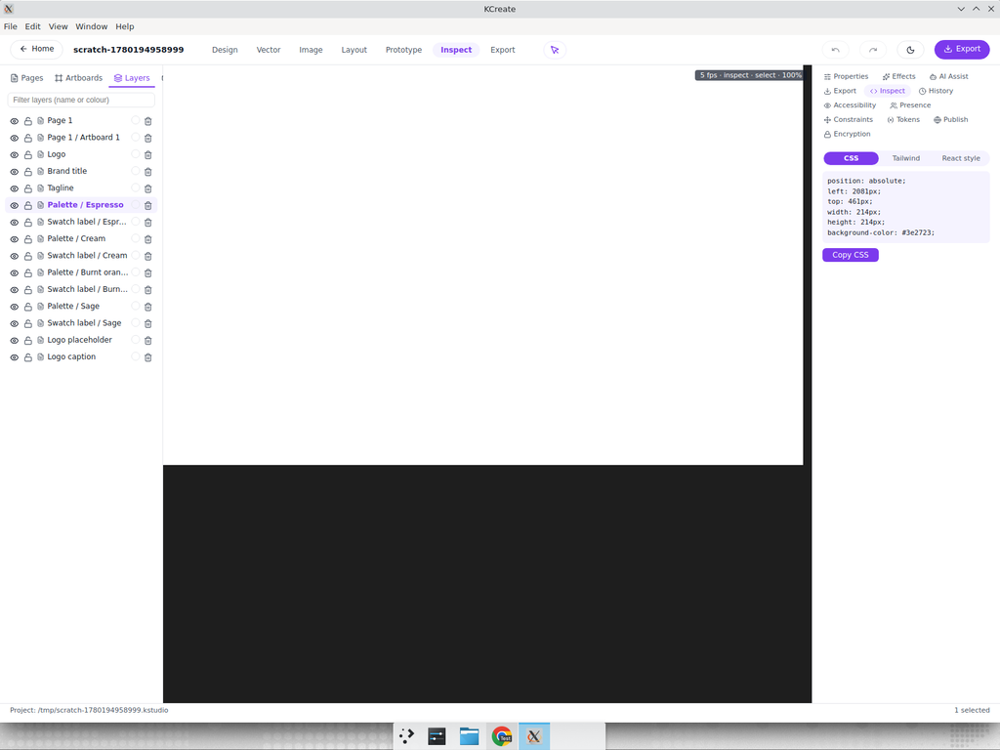 |
| Tailwind     | 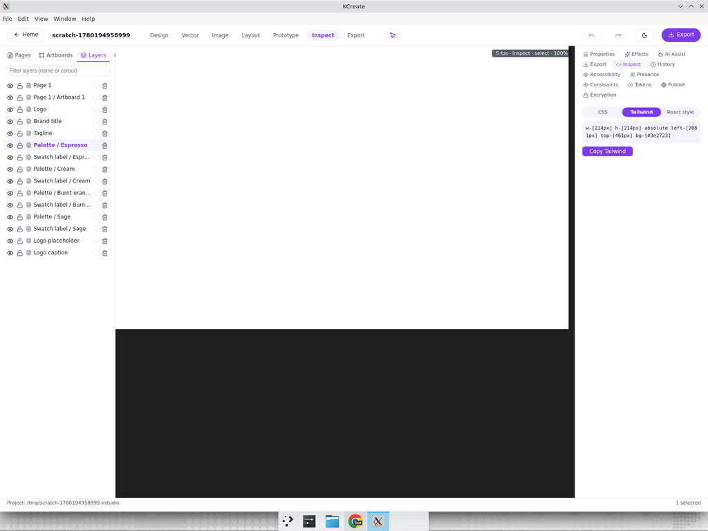       |
| React style  | 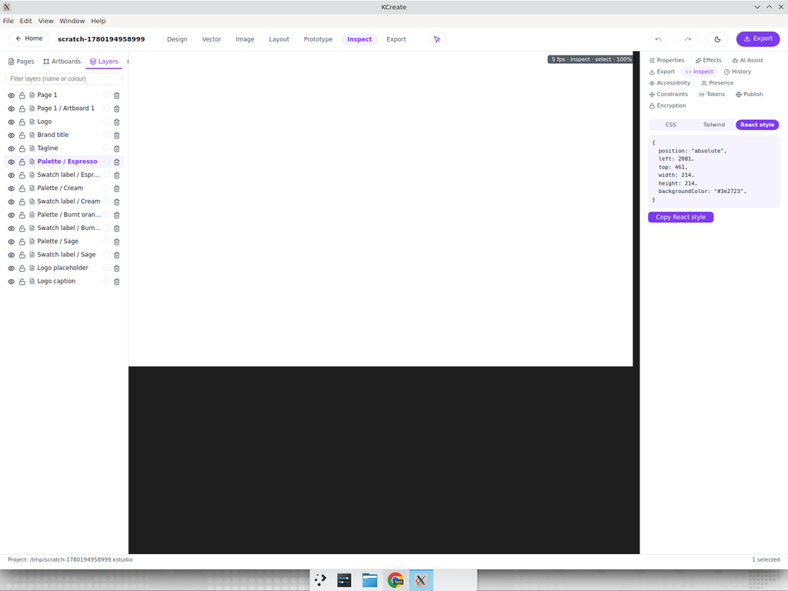             |

The CSS output proves the round-3 `Math.floor` budget invariant
(`4 * 214 + 3 * 15 = 901 ≤ 902 = swatchRowWidth`):

```
position: absolute;
left: 2081px;
top: 461px;
width: 214px;
height: 214px;
background-color: #3e2723;
```

`width = Math.floor((aw - 2*margin - 3*swatchGap) / 4) = floor((1024 - 122 - 45) / 4) = floor(214.25) = 214` ✓.

### 4. Run all five Export batch presets

Switch to **Export** mode, then click each batch-preset row. The status
bar reports the number of files and total bytes per chain.


| Preset            | Result reported in status bar              | Files on disk                                    |
| ----------------- | ------------------------------------------ | ------------------------------------------------ |
| Web Assets        | `3 files · 187 243 bytes`                  | `kcreate-web-assets-…-1x.png` / `-2x.png` / `-3x.png` |
| Social Pack       | `3 files · 42 594 bytes`                   | `…-instagram.png` / `-twitter.png` / `-facebook.png`  |
| Icon Pack         | `6 files · 71 394 bytes`                   | `…-16.png` / `-24.png` / `-32.png` / `-48.png` / `-512.png` / `.svg` |
| Print Ready       | `1 files · 2 015 bytes`                    | `kcreate-print-ready-…pdf`                       |
| Developer Handoff | `2 files · 476 bytes`                      | `…-tokens.json` + `….svg`                        |


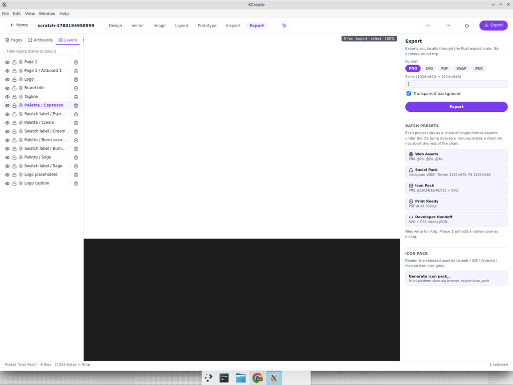


The Developer-Handoff SVG locks in the floor invariant on the real
shipped 1024×1024 preset (four 214-wide swatches with 15px gaps + the
164-wide logo, all inside the artboard bounds):

```svg
<svg width="1024" height="640" viewBox="0 0 1024 640">
  <path d="M2081 461 L2295 461 2295 675 2081 675 Z"/>  <!-- Espresso  214×214 -->
  <path d="M2310 461 L2524 461 2524 675 2310 675 Z"/>  <!-- Cream     214×214 -->
  <path d="M2539 461 L2753 461 2753 675 2539 675 Z"/>  <!-- B. orange 214×214 -->
  <path d="M2768 461 L2982 461 2982 675 2768 675 Z"/>  <!-- Sage      214×214 -->
  <path d="M2081 799 L2245 799 2245 963 2081 963 Z"/>  <!-- Logo      164×164 -->
</svg>
```

### 5. Add a Prototype interaction and Play

Switch to **Prototype** mode. The canvas is replaced by the
responsive-preview cluster (Desktop 1440 / Tablet 768 / Mobile 375),
and the right panel exposes the **Interaction** tab when a layer is
selected.

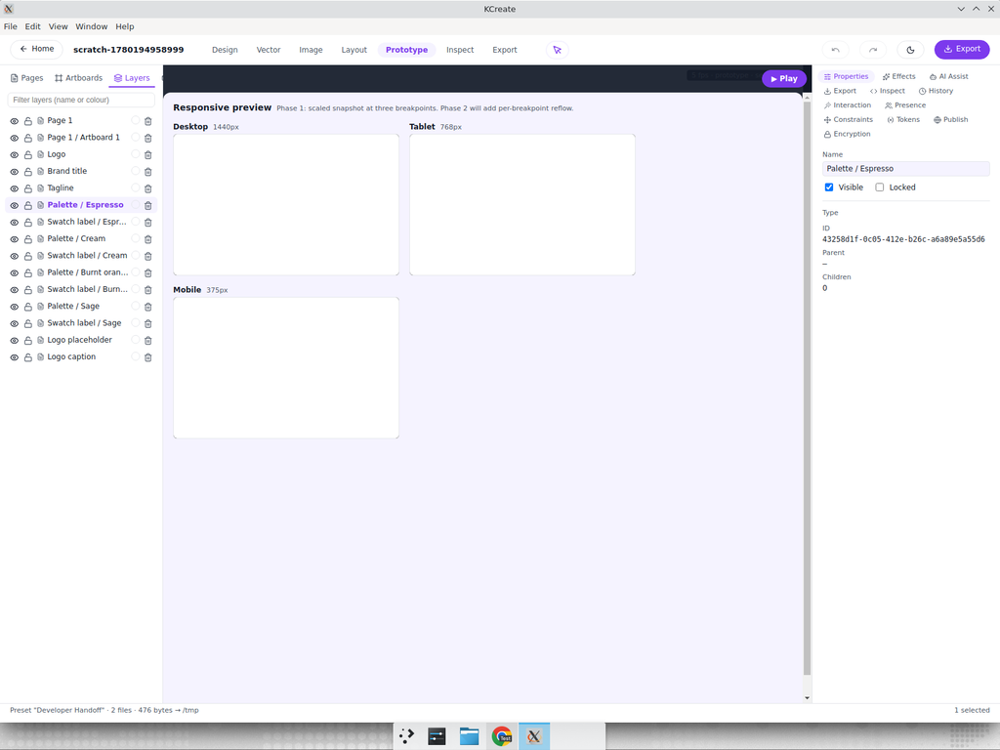
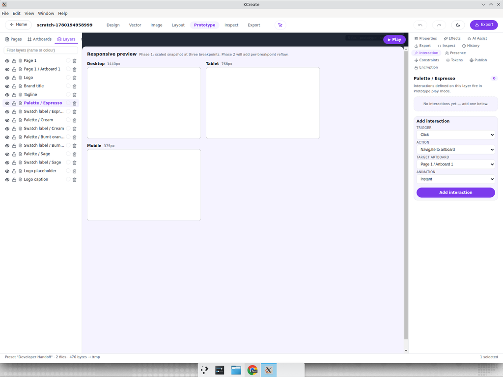

Add a `Click → Navigate to artboard` interaction on the Espresso
swatch. The chip lands in the panel and the status bar confirms
`Interaction added.`

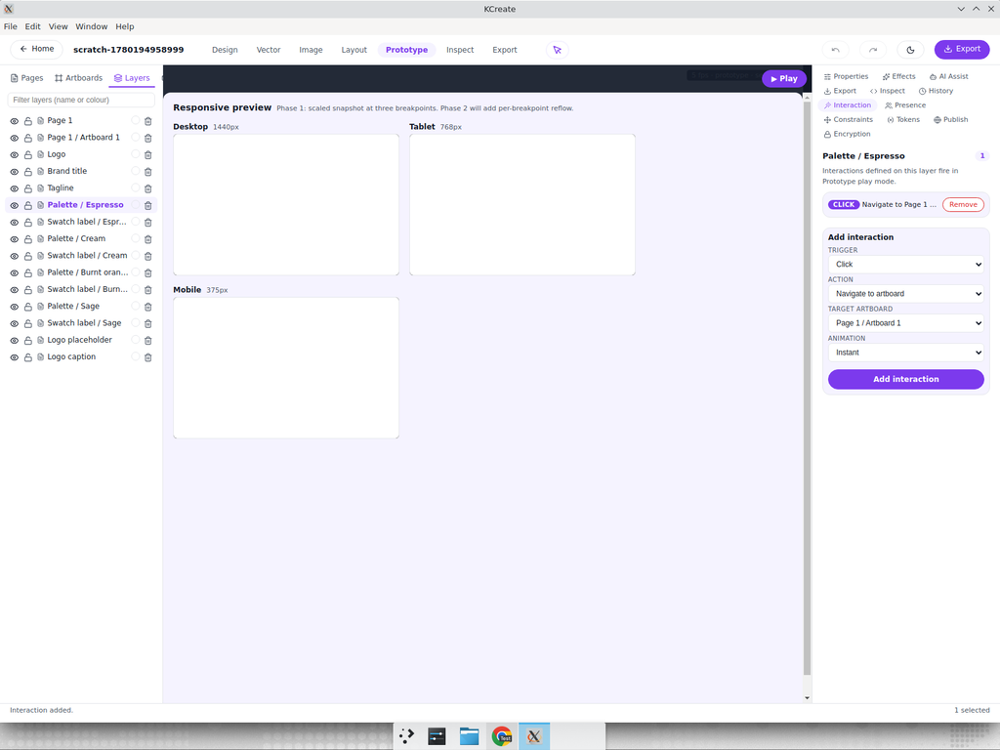

Click **Play** → the editor chrome collapses and the `PrototypePlayer`
opens fullscreen on the target artboard:

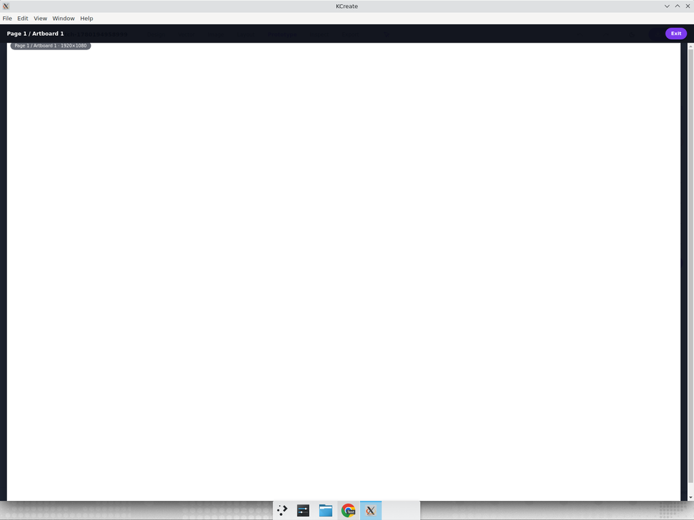

### 6. Color management and Preflight

The **Color** tab (Design / Inspect modes) exposes the working
RGB / CMYK profiles, rendering intent, soft-proof, and gamut warning:

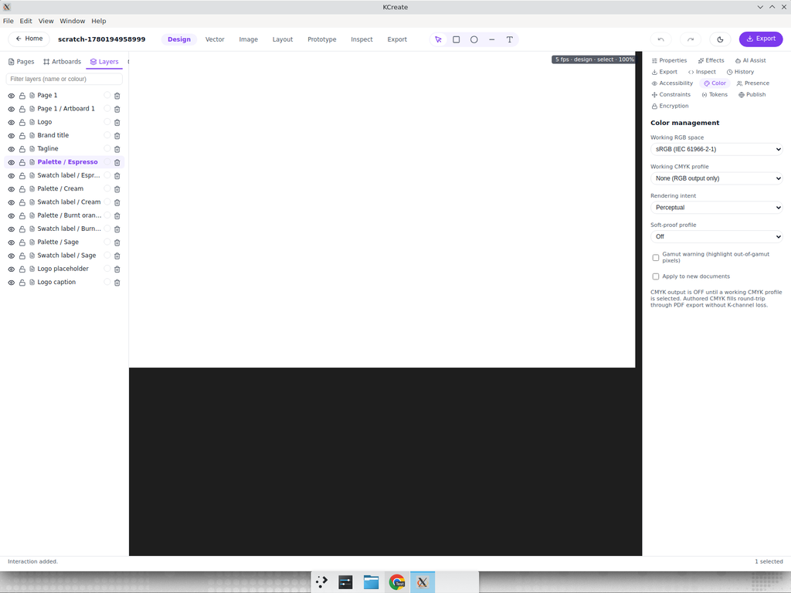

The **Preflight** tab (Layout / Export modes) takes the document
through `kcreate_export::preflight` with a configurable 300-DPI / 3mm-
bleed / 300% max-ink profile:

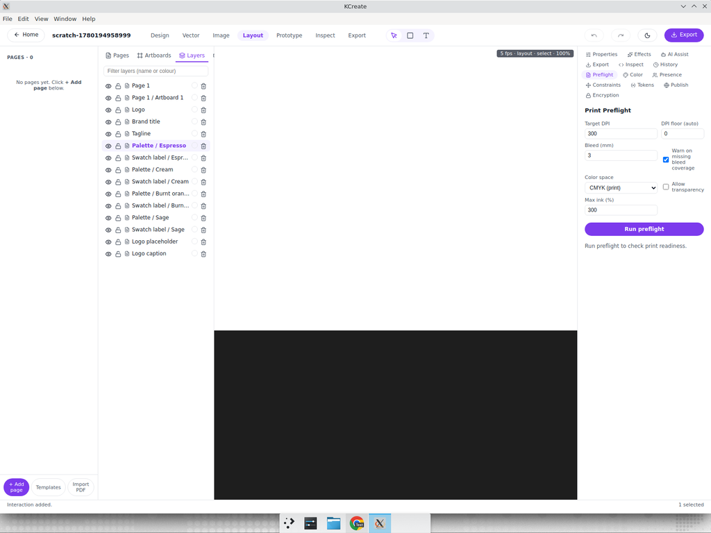

Run → `0 errors · 0 warnings · 1 info` (info note: the empty seed
project has no per-page metadata, so preflight defaulted to 300 DPI).

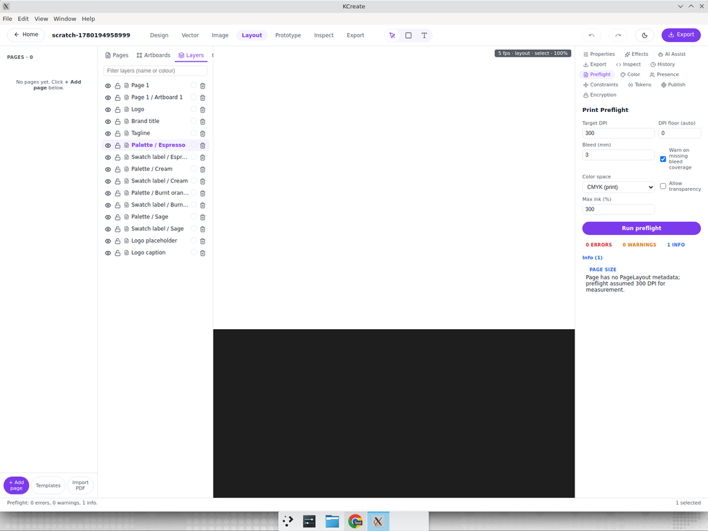

### 7. Exercise the other template resolvers

Return to HomePage and click the remaining template cards. Each one
opens with its resolver's full seed set.

#### Social Media Post (1080×1080)


`Headline band` Inspect CSS proves the geometry: full-bleed
`1080×302px` band, `bandHeight = round(1080 * 0.28) = 302`:


#### Flyer / Poster / Brochure (A4 @ 300 DPI, 2480×3508)

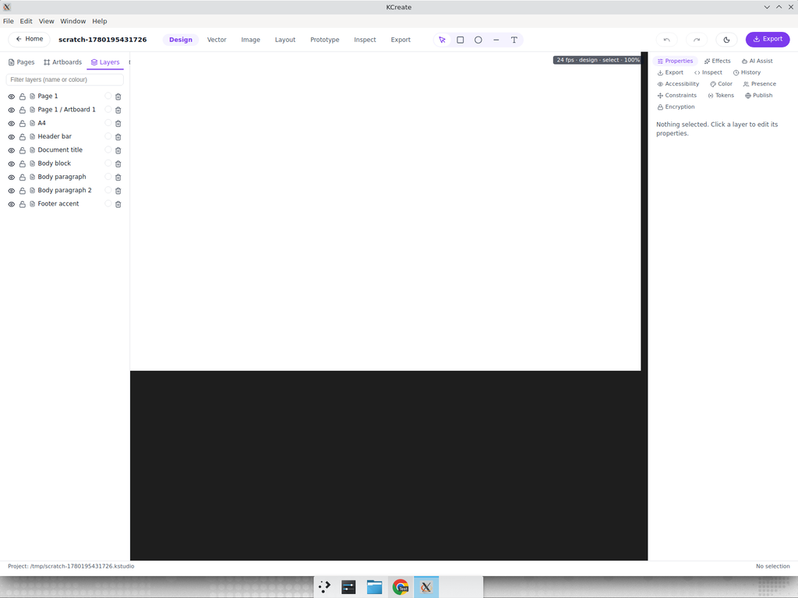

`Header bar` Inspect CSS confirms full-width espresso bar:
`2480×561px`, `headerH = round(3508 * 0.16) = 561`, anchored at the
artboard top:

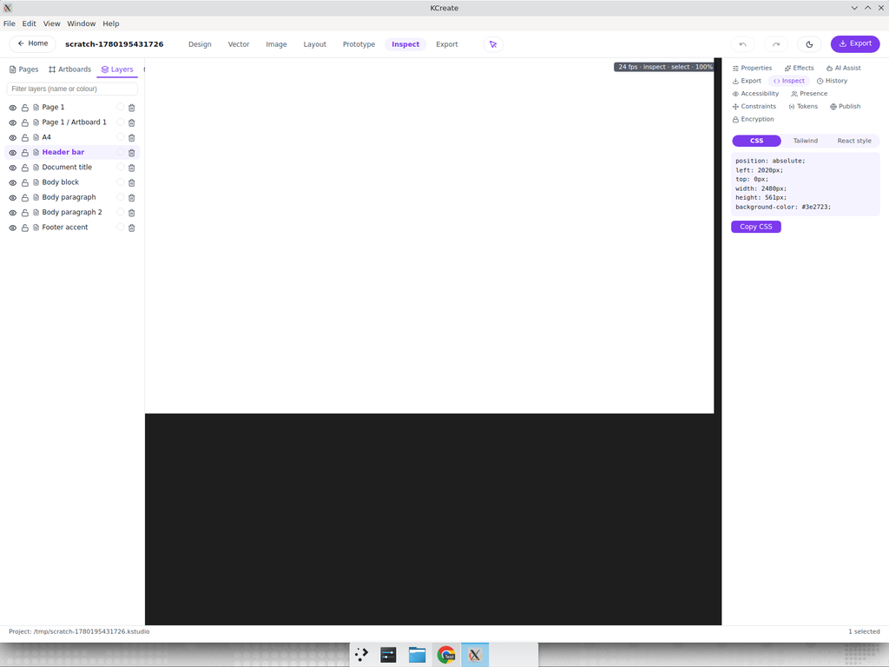

#### App / Website UI (Desktop 1440×900)

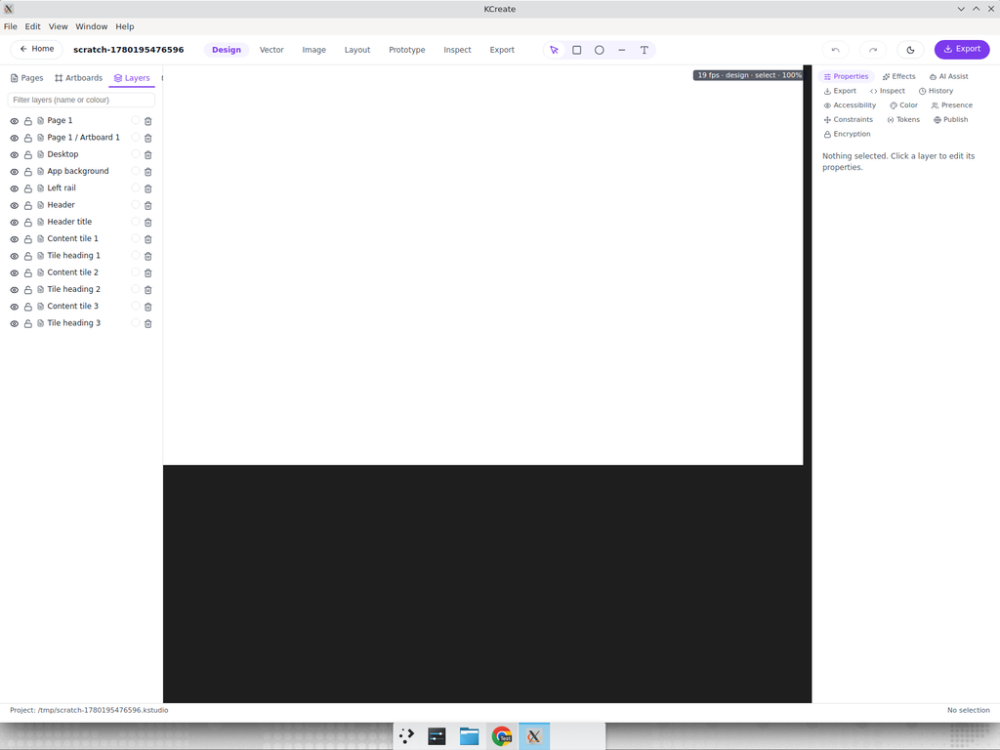

`Content tile 1` Inspect CSS proves both the **`Math.floor` budget
invariant** and the **`Math.max` tileHeight clamp**:

```
width: 379px   = floor((1440 - 173 - 4*32) / 3) = floor(379.67)
height: 764px  = max(0, 900 - 104 - 32)
```

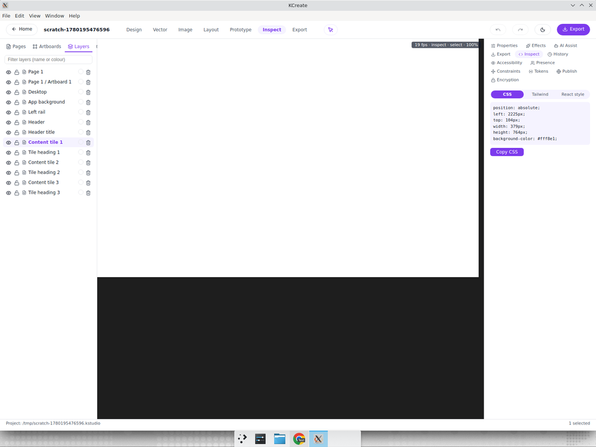

#### Pitch Deck (1920×1080)

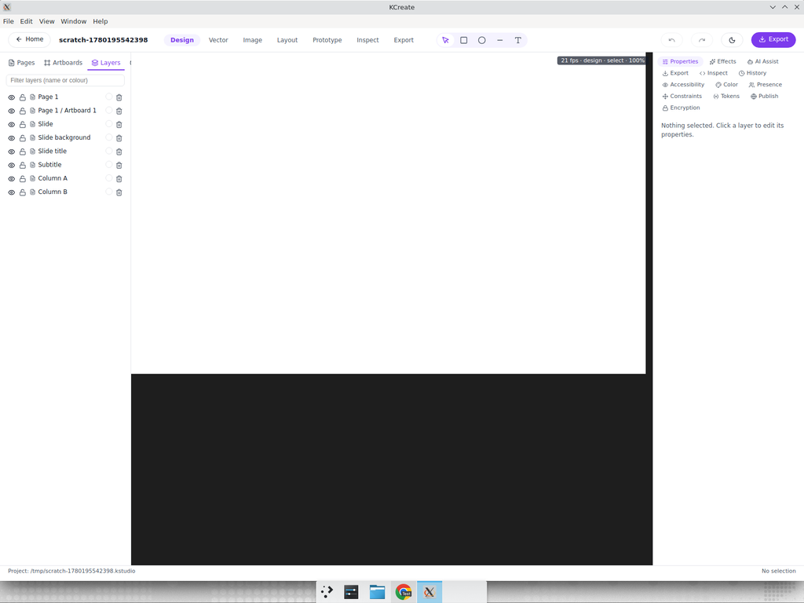

Five seeded nodes (`Slide background`, `Slide title`, `Subtitle`,
`Column A`, `Column B`) per `DECK_RESOLVER`'s documented two-column
budget invariant.

## What changed vs. the v1 demo

| Area                       | v1 demo (`docs/demo/brewline`)             | v2 demo (this file)                                          |
| -------------------------- | ------------------------------------------ | ------------------------------------------------------------ |
| HomePage cards             | Text-only labels                           | Lucide icon + label, theme-aware `currentColor` tinting       |
| Tool selectors             | `Select` / `Rect` / `Ellipse` text         | `mouse-pointer` / `square` / `circle` icons                  |
| Layer panel chips          | Unicode `●○⌧⌬×`                            | `eye`, `eye-off`, `lock`, `unlock`, `trash-2`                 |
| RightPanel tab strip       | Text-only labels                           | Icon + label on every tab (Preflight, Color, Constraints, …) |
| Export batch presets       | Unlabelled rows                            | `globe` / `share` / `grid-2x2` / `printer` / `code` icons    |
| Editor first-paint         | Blank artboard                             | Resolver-seeded canvas (named nodes + Brewline palette)      |
| Brand template content     | None                                       | 12-node brand kit (title, tagline, 4 swatches + 4 labels, logo + caption) |
| Social template content    | None                                       | 5-node Instagram layout (background, band, headline, body, accent) |
| Print template content     | None                                       | 6-node A4 layout (header bar, title, body block, two paragraphs, footer) |
| App-UI template content    | None                                       | 11-node app-shell (background, rail, header + title, 3 tiles + headings) |
| Deck template content      | None                                       | 6-node deck (background, title, subtitle, two columns)        |

## Layout invariants tested in this demo

These came out of Devin Review's three rounds of feedback on PR #31
and are now baked into the template resolvers + the test suite
(`apps/desktop/renderer/tests/templates.test.mjs`, 12 tests pass):

1. **`BRAND_RESOLVER` swatch-budget floor.** `swatchWidth = Math.floor(…)`
   ensures `4*swatchWidth + 3*swatchGap ≤ swatchRowWidth` for any
   future preset, matching DECK / APP_UI. **Test:** `BRAND resolver
   lays out cleanly on the actual 1024×1024 brand preset` (asserts the
   inequality directly).
2. **`APP_UI_RESOLVER` tile-budget floor.** `tileWidth = Math.floor(…)`
   ensures `rail + 4*tileMargin + 3*tileWidth ≤ aw` for any preset.
3. **`APP_UI_RESOLVER` tileHeight clamp.** `tileHeight = Math.max(0, …)`
   so a future short-artboard preset never passes a negative height
   into `createRect`. **Test:** `APP_UI resolver clamps tileHeight to
   >= 0 on a degenerate short artboard` (exercises a 1440×50 surface
   where the unclamped value would be –18).
4. **`DECK_RESOLVER` two-column floor + clamp.** Already present
   pre-PR; `colWidth = Math.floor(…)`, `colHeight = Math.max(0, …)`,
   plus a documented invariant in the source comments.

## Files in this demo

```
docs/demo/brewline-v2/
├── README.md         this file
├── CHANGELOG.md      delta vs. v1 demo
└── screenshots/      25 PNGs (homepage → all five template seeds → 5 exports → prototype → color → preflight)
```

## Re-running this demo

```bash
# 1. Pull and build
git checkout devin/1780189966-svg-icons-and-template-scaffolding
pnpm install
pnpm --filter @kcreate/desktop build

# 2. Local sanity (all green)
pnpm --filter @kcreate/desktop typecheck
pnpm --filter @kcreate/desktop lint
pnpm --filter @kcreate/desktop test    # 12/12 pass in ~100ms

# 3. Launch
cd apps/desktop && pnpm start
```

Then walk through Steps 1–7 above. Every screenshot in
`screenshots/` was captured against the binary built from the head
of this branch (commit at time of demo: `HEAD` of
`devin/1780189966-svg-icons-and-template-scaffolding`).
